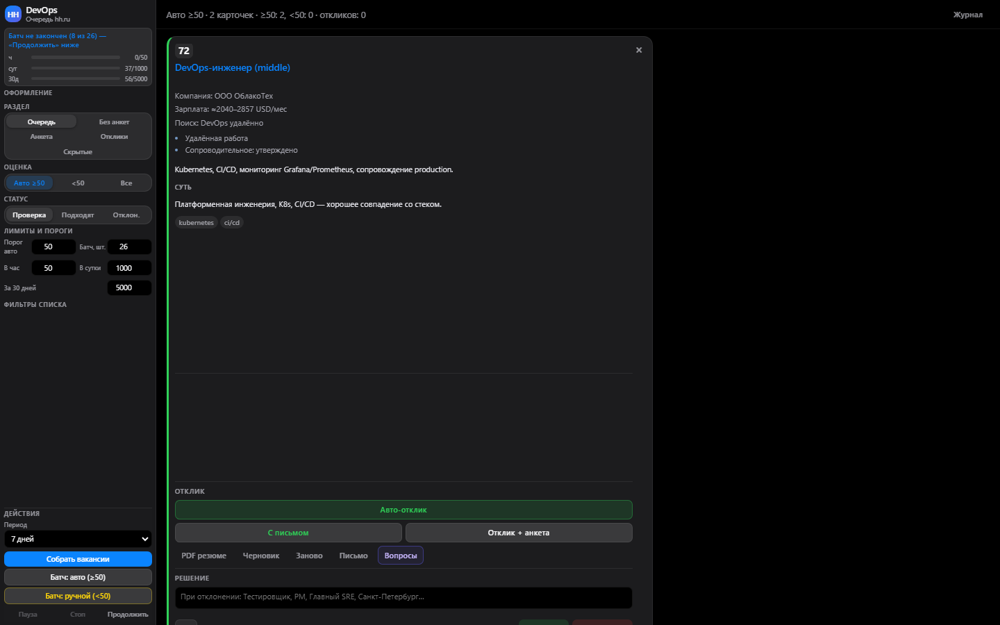
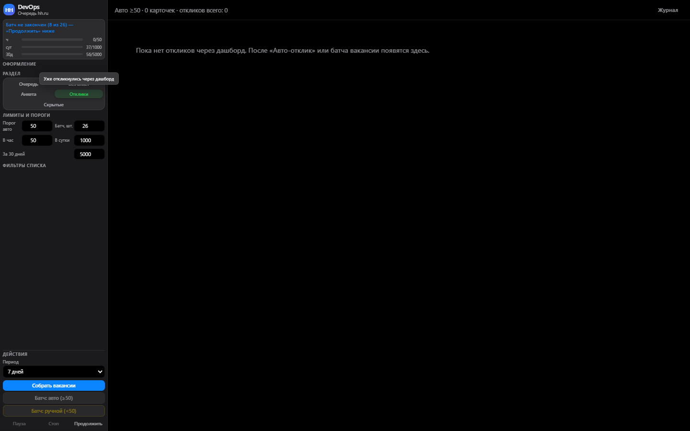
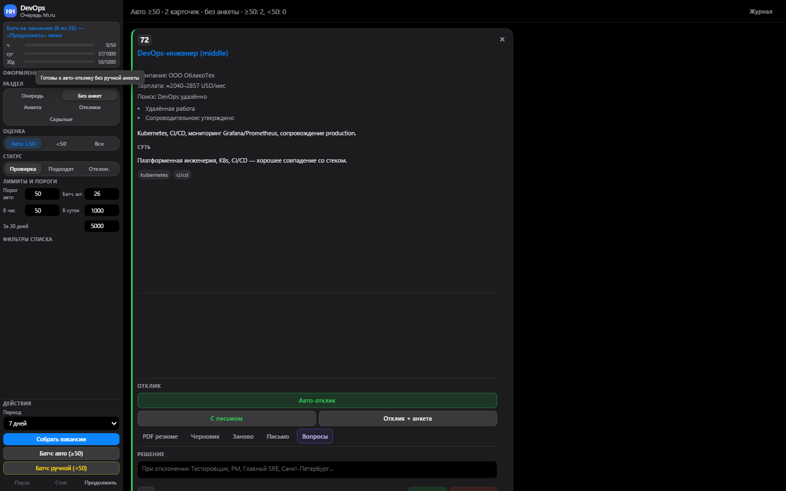

# HH Ai — локальный помощник откликов на hh.ru

[](https://github.com/emildg8/HH_Ai/releases)
[](LICENSE)

**Версия:** 2.0.0 · [**Быстрый старт**](docs/QUICKSTART.md) · [Документация](docs/README.md) · [Скачать zip](https://github.com/emildg8/HH_Ai/releases/latest)

Автоматизация [hh.ru](https://hh.ru): сбор вакансий, LLM-оценка, сопроводительные, отклик через Playwright, дашборд с анкетой и батч-откликами.

| Очередь вакансий | Батч-отклик | Анкета работодателя |
|:---:|:---:|:---:|
|  |  |  |

> **Репозиторий:** [github.com/emildg8/HH_Ai](https://github.com/emildg8/HH_Ai)  
> Автоотклики могут противоречить правилам hh.ru — используйте умеренно. [SECURITY.md](SECURITY.md)

---

## Установка за 3 команды

### Windows

```powershell
git clone https://github.com/emildg8/HH_Ai.git
cd HH_Ai
powershell -ExecutionPolicy Bypass -File scripts/install.ps1
npm run login
npm run dashboard
```

### macOS / Linux

```bash
git clone https://github.com/emildg8/HH_Ai.git
cd HH_Ai
bash scripts/install.sh
npm run login
npm run dashboard
```

→ **http://127.0.0.1:3849**

**Без git:** [скачать zip](https://github.com/emildg8/HH_Ai/releases/latest) → распаковать → `install.ps1` / `install.sh`

Пошагово: **[docs/QUICKSTART.md](docs/QUICKSTART.md)**

---

## Возможности

| Функция | Описание |
|---------|----------|
| **Дашборд** | Очередь, LLM-письма, анкета, светлая/тёмная тема |
| **Harvest** | Сбор с hh.ru + оценка (LLM или локально) |
| **Батч** | Массовый отклик; анкеты откладываются ([BATCH.md](docs/BATCH.md)) |
| **Профили** | `HH_PROFILE` — DevOps и свои роли |
| **Капча** | Ожидание ручного решения в Chromium |
| **Релиз** | `npm run release:public` — zip без секретов |

---

## Документация

| | |
|---|---|
| [**QUICKSTART.md**](docs/QUICKSTART.md) | **5 шагов — с нуля до отклика** |
| [docs/README.md](docs/README.md) | Оглавление |
| [USAGE.md](docs/USAGE.md) | Полный рабочий цикл |
| [DASHBOARD.md](docs/DASHBOARD.md) | Интерфейс |
| [CONFIG.md](docs/CONFIG.md) | Переменные и конфиги |
| [TROUBLESHOOTING.md](docs/TROUBLESHOOTING.md) | Решение проблем |
| [PUBLIC-RELEASE.md](docs/PUBLIC-RELEASE.md) | Для получателя zip |

---

## Команды

| Команда | Назначение |
|---------|------------|
| `npm run dashboard` | Локальный UI |
| `npm run harvest` | Сбор и оценка |
| `npm run login` | Сессия hh.ru |
| `npm run devops:apply-batch` | Массовый отклик |
| `npm run verify:local` | Проверка установки |
| `npm run release:public` | Zip для передачи |

---

## Требования

Node.js **18+** · `npx playwright install chromium` (делает `install.ps1`)

## Лицензия

MIT · [ATTRIBUTION.md](docs/ATTRIBUTION.md)
