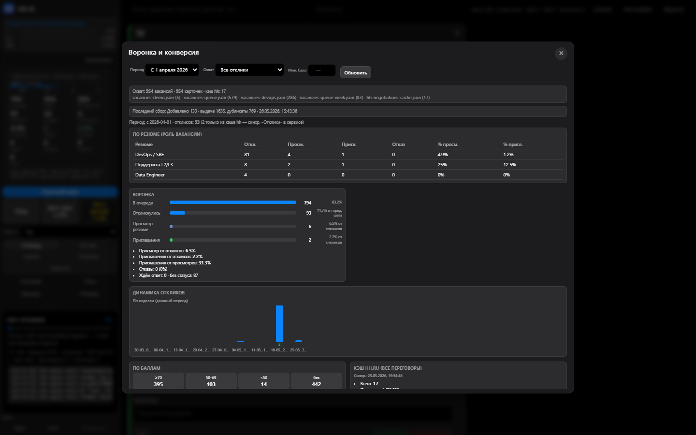

# HH Ai — локальный помощник откликов на hh.ru

[](https://github.com/emildg8/HH_Ai/releases)
[](LICENSE)

**Версия:** 3.0.4 · [**Быстрый старт**](docs/QUICKSTART.md) · [Документация](docs/README.md) · [Скачать](https://github.com/emildg8/HH_Ai/releases/latest) · [Changelog](CHANGELOG.md)

Автоматизация [hh.ru](https://hh.ru): сбор вакансий, LLM-оценка, сопроводительные, отклик через Playwright, дашборд с анкетой и батч-откликами.

| Очередь | Аналитика | Батч |
|:---:|:---:|:---:|
|  |  |  |

> **Репозиторий:** [github.com/emildg8/HH_Ai](https://github.com/emildg8/HH_Ai)  
> Автоотклики могут противоречить правилам hh.ru — используйте умеренно. [SECURITY.md](SECURITY.md)

---

## Установка

### Windows — приложение (рекомендуется)

1. Скачайте **`HH-Ai_*-setup.exe`** с [Releases](https://github.com/emildg8/HH_Ai/releases/latest).
2. Установите и запустите **HH Ai** из меню Пуск.
3. На первом экране: **Установить Chromium** → `login` на hh.ru (см. [FIRST-RUN.md](docs/FIRST-RUN.md)).

### Windows / macOS / Linux — git

```powershell
git clone https://github.com/emildg8/HH_Ai.git
cd HH_Ai
powershell -ExecutionPolicy Bypass -File scripts/install.ps1   # или bash scripts/install.sh
npm run login
npm run dashboard
```

→ **http://127.0.0.1:3849**

### Без git — portable zip

[Скачать zip](https://github.com/emildg8/HH_Ai/releases/latest) → `install-portable.ps1` → `start-dashboard.bat`

**Быстрый лauncher:** `powershell -File start-hh-ai.ps1`

После install: `npm run setup:check`

---

## Возможности

| Функция | Описание |
|---------|----------|
| **Desktop 3.0** | Tauri-приложение: дашборд без терминала, sidecar, Chromium в один клик |
| **Дашборд** | Очередь, LLM-письма, анкета, CRM-воронка, светлая/тёмная тема |
| **Harvest** | Сбор с hh.ru + оценка (LLM или локально) |
| **Батч** | Массовый отклик; анкеты — авто-ответы ([BATCH.md](docs/BATCH.md)) |
| **Профили** | `HH_PROFILE` — DevOps и свои роли |
| **Релиз** | Portable zip + Windows installer в CI |

---

## Документация

| | |
|---|---|
| [**QUICKSTART.md**](docs/QUICKSTART.md) | **5 шагов — с нуля до отклика** |
| [**PUBLIC-RELEASE.md**](docs/PUBLIC-RELEASE.md) | **Desktop exe + zip для нового пользователя** |
| [**CONFIG-GUIDE.md**](docs/CONFIG-GUIDE.md) | LLM, профиль, обучение модели |
| [docs/README.md](docs/README.md) | Оглавление |
| [TAURI-PLAN.md](docs/TAURI-PLAN.md) | Desktop-приложение |
| [TROUBLESHOOTING.md](docs/TROUBLESHOOTING.md) | Решение проблем |

---

## Для мейнтейнера

```powershell
npm run verify:local
npm run qa:clean-install
npm run release:public
npm run desktop:bundle    # перед tauri build
```

Тег `v3.0.0` → GitHub Release: zip + NSIS installer.

---

## Лицензия

MIT · Идея-основа: [Steev193/hh-ru-apply](https://github.com/Steev193/hh-ru-apply) · [ATTRIBUTION.md](docs/ATTRIBUTION.md)
