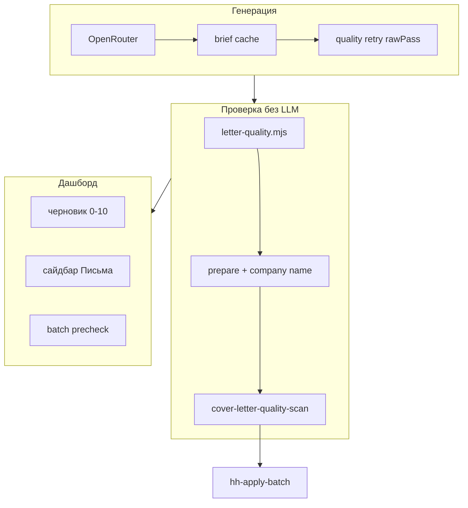

# Качество сопроводительных и таргетинг

**Версия:** 3.2.0 · связанные документы: [BATCH.md](BATCH.md), [CONFIG-GUIDE.md](CONFIG-GUIDE.md), [QUEUE-AND-APPLY.md](QUEUE-AND-APPLY.md)

План внедрения «волны качества» (2026-06): автоподготовка писем, регрессия таргетинга, обучение из отказов, precheck перед батчем.

---

## Статус фаз

| Фаза | Содержание | Статус |
|------|------------|--------|
| **A** | Сайдбар «Письма», letter-center, черновик (✓/~/?), настройки батча | [x] |
| **B** | Retry по `rawPass`, кэш брифа, company name, отчёт после батча, `letterScore10` | [x] |
| **C** | FP-тренды, style insights, auto-learning (безопасные правила), snippets из user-edits | [x] |
| **D** | Precheck-модалка, golden set, guardrail FP, skip reason на карточке | [x] |
| **E** | `test:letters` / `test:targeting` / `test:quality` в CI | [x] |
| **F** | Документация, `audit:targeting-golden`, nightly audit (локально) | [x] |
| **G** | Golden set писем (`letter-quality-golden-set.json`), quality-hub API, UI «Подробнее» | [x] |
| **H** | `audit:quality-golden`, `quality:check`, suggest `--write`, verify-local + dashboard API smoke | [x] |
| **I** | Полировка UX: гонки запросов, цвет 0–10, precheck-meter, Alt+L, палитра команд | [x] |
| **J** | Модалка настроек: вкладка «Письма», пресеты, hub-снимок — см. [SETTINGS-MODAL-PLAN.md](SETTINGS-MODAL-PLAN.md) | [x] S1–S4 |

Расширение golden из очереди: `devops:suggest-targeting-golden` / `devops:suggest-letter-golden` с `--write`.

## Критерии «10/10» (самопроверка)

| Критерий | Реализация |
|----------|------------|
| Один источник правды | `evaluateLetterQuality` + `letterQualityForListRow` + golden set |
| CI не пропускает регрессию | `quality:check` + golden в PR |
| UI без залипания | `invalidateLetterStatsCache`, race-guard, hub cache 20 с |
| Батч предсказуем | precheck + meter + id в отчёте |
| Оператор видит приоритет | fixable → fail → score, фильтры ⚙ ✕ ? |
| Быстрый доступ | Клик «Письма», Alt+L, палитра `Ctrl+K` |

---

## Архитектура (кратко)



---

## Ключевые модули

| Модуль | Назначение |
|--------|------------|
| `lib/letter-quality.mjs` | Правила: длина, плейсхолдеры, роль, метрики |
| `lib/cover-letter-quality-scan.mjs` | `evaluateLetterQuality`, `improveApprovedLetterForVacancy`, `letterScore10` |
| `lib/cover-letter-quality-retry.mjs` | Повтор LLM, если `rawPass` не прошёл |
| `lib/cover-letter-brief-cache.mjs` | Кэш matching brief на карточке (TTL 14 дней) |
| `lib/cover-letter-company-name.mjs` | «ваша команда» → название компании |
| `lib/letter-score.mjs` | Оценка 0–10, выбор лучшего варианта |
| `lib/batch-letter-quality-report.mjs` | `data/letter-quality-report.json` после батча |
| `lib/false-positive-analytics.mjs` | FP-сводка, снимки, guardrail, learning suggestions |
| `lib/targeting-golden-set.mjs` | Регрессия `config/targeting-golden-set.json` (22+ кейсов) |
| `lib/letter-quality-golden-set.mjs` | Регрессия `config/letter-quality-golden-set.json` |
| `lib/cover-letter-quality-hub.mjs` | Сводка для дашборда (метрики, батч, golden, правки) |
| `lib/quality-baseline.mjs` | Сводка eligible / FP / golden / invite |
| `lib/learning-auto-apply.mjs` | Авто-правила при count ≥ 3 |

---

## API дашборда

| Метод | Путь | Назначение |
|-------|------|------------|
| GET | `/api/cover-letter/stats` | Счётчики pass/fixable/fail, `letterReadyRate` |
| GET | `/api/cover-letter/issues` | Список проблем для letter-center |
| GET | `/api/cover-letter/metrics-summary` | LLM pass rate, retry |
| GET | `/api/cover-letter/invite-correlation` | invited vs applied |
| GET | `/api/cover-letter/style-insights` | Термины из invited-писем |
| GET | `/api/cover-letter/letter-quality-report` | Последний отчёт батча |
| GET | `/api/quality/baseline` | Baseline метрик |
| GET | `/api/cover-letter/quality-hub` | Hub: метрики LLM, отчёт батча, golden, user-edits |
| GET | `/api/targeting/golden-regression` | Прогон golden set |
| GET | `/api/batch-precheck` | Готовность к батчу + guardrail FP |
| POST | `/api/cover-letter/bulk-improve` | Массовая подготовка (prepare) |
| POST | `/api/learning/auto-apply-safe` | Безопасные правила из FP |

---

## Настройки (`config/preferences.json`)

UI: дашборд → **Настройки** → вкладки **Отклики** / **Письма** / **Интерфейс**. Подробный план: [SETTINGS-MODAL-PLAN.md](SETTINGS-MODAL-PLAN.md).

| Ключ | По умолчанию | Смысл |
|------|--------------|--------|
| `batchAutoPrepareLetters` | true | Перед батчем подготовить fixable письма |
| `batchLetterRequireMetric` | — | Требовать метрики в письме |
| `batchAutoApproveBestLetter` | — | Авто-утверждение лучшего варианта |
| `batchFalsePositiveMax` | 20 | Guardrail: стоп precheck при высоком FP% |
| `learningAutoApplyPatterns` | false | Авто-правила из FP (раз в день в UI) |
| `learningAutoApplyMinCount` | 3 | Минимум повторов паттерна |

---

## Команды

```bash
# Полная проверка качества (тесты + golden)
npm run quality:check

# Юнит-тесты (CI: test:ci-quality)
npm run test:letters
npm run test:targeting
npm run test:quality

# Регрессия golden (таргетинг + письма)
npm run audit:quality-golden
npm run audit:targeting-golden
npm run audit:letter-quality-golden

# Локальный ночной срез (нужна очередь data/)
npm run nightly:quality-audit

# Кандидаты в golden из rejected → config/targeting-golden-set.candidates.json
npm run devops:suggest-targeting-golden
npm run devops:suggest-targeting-golden -- --write --limit=5

# Кандидаты golden писем из слабых approved → config/letter-quality-golden-set.candidates.json
npm run devops:suggest-letter-golden -- --limit=12
npm run devops:suggest-letter-golden -- --write --limit=5

# Слабые письма
npm run devops:regenerate-letters -- --only-fail --limit=30
```

---

## Данные

| Файл | Содержание |
|------|------------|
| `data/letter-metrics.jsonl` | События generate (qualityPass, retry) |
| `data/false-positive-snapshots.jsonl` | Снимки FP для трендов |
| `data/letter-quality-report.json` | Отчёт последнего батча |
| `data/nightly-quality-audit-last.json` | Результат `nightly:quality-audit` |
| `data/cover-letter-user-edits.jsonl` | Правки пользователя → few-shot |
| `config/targeting-golden-set.json` | Эталонные кейсы таргетинга |

---

## Рабочий цикл перед батчем

1. Утвердить письма в очереди (или включить автоподготовку).
2. Запустить батч из дашборда → **precheck**: письма, FP guardrail, нецелевые.
3. При необходимости: «Подготовить» в модалке или сайдбаре «Письма».
4. После батча: `data/letter-quality-report.json`, сайдбар baseline (FP / golden / invite).

---

## CI

- Каждый push/PR: `npm run test:ci-quality` в [.github/workflows/ci.yml](../.github/workflows/ci.yml).
- Понедельник 04:00 UTC: [quality-audit.yml](../.github/workflows/quality-audit.yml) — golden + тесты.
