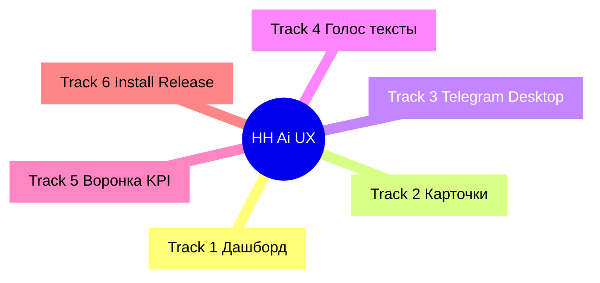
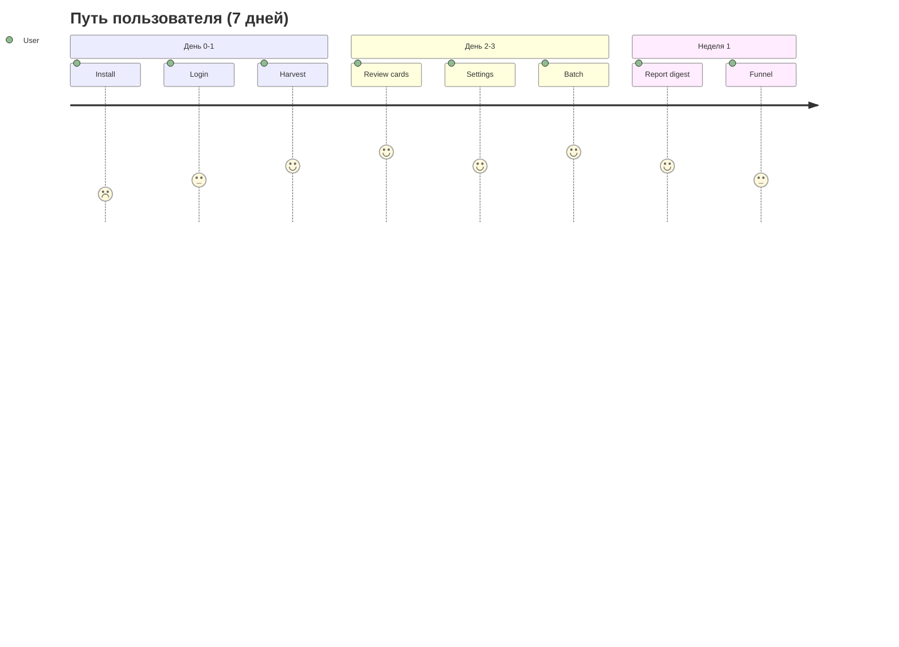
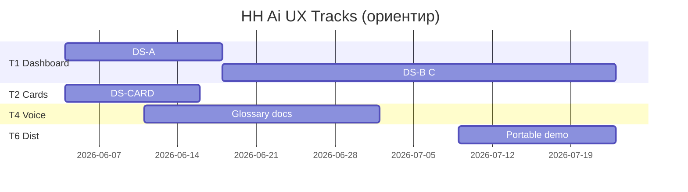

# Планирование: опыт продукта HH Ai (широкий scope)

**Версия плана:** 3.0 · **2026-06-03**  
**Горизонт:** Q2 2026 – Q1 2027 (~9 мес. эволюции UX)  
**Индекс всех документов:** [DESIGN-ECOSYSTEM-INDEX.md](DESIGN-ECOSYSTEM-INDEX.md)  
**Справочник дашборда:** [DESIGN-SYSTEM-2026-06.md](DESIGN-SYSTEM-2026-06.md)  
**Связано:** [USER-UX-PLAN-2026-06.md](USER-UX-PLAN-2026-06.md) · [DEVELOPMENT-IDEAS.md](DEVELOPMENT-IDEAS.md) · [CARD-DESIGN-SYSTEM.md](CARD-DESIGN-SYSTEM.md) · [ROADMAP.md](ROADMAP.md) (Q14–Q16)

---

## Оглавление

1. [Резюме](#1-резюме)  
2. [Карта поверхностей](#2-карта-поверхностей)  
3. [Шесть дорожек](#3-шесть-дорожек)  
4. [Видение и путь пользователя](#4-видение-и-путь-пользователя)  
5. [Принципы (весь продукт)](#5-принципы-весь-продукт)  
6. [Track 1 — Дашборд (DS-A…D)](#6-track-1--дашборд-ds-ad)  
7. [Track 2 — Карточки и список](#7-track-2--карточки-и-список)  
8. [Track 3 — Каналы и автоматизация](#8-track-3--каналы-и-автоматизация)  
9. [Track 4 — Голос и контент](#9-track-4--голос-и-контент)  
10. [Track 5 — Аналитика и воронка](#10-track-5--аналитика-и-воронка)  
11. [Track 6 — Дистрибуция и онбординг](#11-track-6--дистрибуция-и-онбординг)  
12. [Календарь спринтов S1–S12](#12-календарь-спринтов-s1s12)  
13. [Приёмка и метрики](#13-приёмка-и-метрики)  
14. [Риски](#14-риски)  
15. [Каталог DS-01…30](#15-каталог-ds-0130)  
16. [DoD и команды](#16-dod-и-команды)  
17. [История плана](#17-история-плана)

---

## 1. Резюме

| | |
|---|---|
| **Scope v3** | Не только CSS дашборда — **весь опыт HH Ai**: UI, карточки, Telegram, desktop, тексты, воронка, первый запуск |
| **Сейчас** | Дашборд: unify, QA 10/10, USER-UX; карточки: отдельный [CARD-DESIGN-SYSTEM](CARD-DESIGN-SYSTEM.md); friction-log начат |
| **North Star** | Новый пользователь за **один вечер**: install → login → harvest → первый батч → отчёт в Telegram/дашборде — **без README и без «ломающегося» UI** |
| **Параллельно** | 6 дорожек; дашборд (Track 1) — критический путь S1–S4 |
| **Горизонт** | ~12 нед. интенсив + 6 мес. зрелость (аналитика, desktop polish) |



---

## 2. Карта поверхностей

| # | Touchpoint | Кто видит | Единый стиль через | Зрелость |
|---|------------|-----------|-------------------|----------|
| 1 | Дашборд `:3849` | ежедневно | `--hh-*`, unify | высокая (база) |
| 2 | Карточки очереди (3 плотности) | ежедневно | `--cq-*` → `--ui-*` | средняя |
| 3 | Модалки (настройки, батч, hub) | часто | unify + modal-layout | высокая |
| 4 | Chromium hh.ru (авто) | фоново | human-delay, captcha UX | низкая (вне CSS) |
| 5 | Telegram-бот | опционально | формат сообщений | низкая |
| 6 | Desktop Tauri | часть пользователей | WebView = дашборд | средняя |
| 7 | CLI / npm / логи | power users | цвета терминала, тексты | низкая |
| 8 | Docs (QUICKSTART, FIRST-RUN) | первый день | тон, скриншоты | средняя |
| 9 | GitHub Release / zip | новые | README + 1 скрин | низкая |
| 10 | Воронка / digest | аналитика | funnel modal, charts | средняя |

**Правило v3:** любая новая поверхность сначала получает **слот в таблице** и **ID в §15**, потом код.

---

## 3. Шесть дорожек

| Track | Название | Фазы | Приоритет 2026-H2 | Владелец (роль) |
|-------|----------|------|-------------------|-----------------|
| **1** | Дашборд chrome | DS-A…D | P0 | frontend/dashboard |
| **2** | Карточки и список | DS-CARD | P0 | cards + tokens |
| **3** | Каналы | DS-CHAN | P1 | bot + desktop |
| **4** | Голос и контент | DS-VOICE | P1 | docs + copy в app |
| **5** | Аналитика | DS-DATA | P2 | funnel + KPI |
| **6** | Дистрибуция | DS-DIST | P1 | release + setup |

Дорожки **1+2** синхронизируются в S1 (общая палитра). **4+6** — параллельно без блокировки CSS.

---

## 4. Видение и путь пользователя

### 4.1 Персоны

| Персона | Цель | Боль сегодня | Track |
|---------|------|--------------|-------|
| **Охотник** | 20+ откликов/день | Жаргон, разный UI | 1,2,3 |
| **Аккуратный** | Качество писем | Непонятный precheck | 1,4 |
| **Новичок** | Первый запуск | Setup, Node, login | 6,4 |
| **Аналитик** | Воронка, FP | Разрозненные цифры | 5 |
| **Мейнтейнер** | Не сломать UI | 5 CSS файлов | 1,D |

### 4.2 Путь (end-to-end)

| Этап | Действие | Touchpoints | Критерий успеха |
|------|----------|-------------|-----------------|
| D0 | Скачать / clone | Release, install.ps1 | ≤15 мин до `dashboard` |
| D1 | Login hh | Chromium | Сессия сохранена |
| D2 | Harvest | дашборд, лог | Очередь не пуста |
| D3 | Разбор | карточки, фильтры | Понятен балл и статус |
| D4 | Настройки писем | settings, precheck | Пресет «Стандарт» |
| D5 | Батч | precheck, Chromium | ≥1 успешный отклик |
| D6 | Обратная связь | отчёт, Telegram?, KPI | Понятен итог дня |
| D7 | Неделя 2 | digest, hub, воронка | Корректировка таргетинга |



---

## 5. Принципы (весь продукт)

| ID | Принцип | Дашборд | Карточки | Telegram | Docs |
|----|---------|---------|----------|----------|------|
| P1 | Токены первыми | `--hh-*` | `--cq-*` | emoji sparingly | — |
| P2 | Две поверхности | elevated/tile | card/list/foot | plain text blocks | headings |
| P3 | Plain language | да | метки статуса | /help человеческий | без жаргона |
| P4 | Один цикл 1–4 | workflow | фильтры по шагу | команды ↔ шаг | QUICKSTART |
| P5 | Progressive disclosure | simple/expert | compact→full | базовые/продвинутые | FIRST-RUN |
| P6 | Ошибка = действие | toast + CTA | hint на карточке | «что сделать» | TROUBLESHOOTING |
| P7 | Кросс-поверхность | accent #0a84ff везде | score colors = ds-good/warn | — | скрины из дашборда |
| P8 | Friction → backlog | UX-FRICTION-LOG | — | — | — |

### Анти-паттерны (продукт)

- Три разных слова для одного («FP», «false positive», «Неподходит») в одном экране  
- Скриншоты в docs с устаревшим UI  
- Telegram-алерты без ссылки `?settings=` в дашборд  
- Новая фича без empty state  
- Desktop installer без `check:dashboard` перед сборкой  

---

## 6. Track 1 — Дашборд (DS-A…D)

> Детали без изменений от v2.0 — ядро визуальной системы.

### Статус

| Фаза | Статус |
|------|--------|
| База (unify, QA) | [x] |
| DS-A | [x] 2026-06-03 |
| DS-B | [~] паттерны hh-empty/status |
| DS-C | [~] workflow/deep links/glossary |
| DS-D | [~] STYLE_VERSION + check:design-tokens |

### DS-A — Визуальная целостность (S1, 8–10 дн.)

| ID | Задача | Дни | Файлы | Gate |
|----|--------|-----|-------|------|
| DS-A1 | v4 → hh токены | 2 | dashboard-v4.css | нет raw hex |
| DS-A2 | cq = ui палитра | 3 | tokens, card-tiles, cards | 3 плотности |
| DS-A3 | Light theme | 1 | tokens, light-polish | §13.A |
| DS-A4 | Lint hex | 1 | lib/, check-dashboard | CI |
| DS-A5 | hh-text-* | 1 | unify | 4 уровня |

### DS-B — Паттерны (S2–S3)

| ID | Задача | Дни | Gate |
|----|--------|-----|------|
| DS-B1 | toast, alert, empty classes | 2 | 3 паттерна |
| DS-B2 | empty очередь/отчёт | 1 | CTA |
| DS-B3 | status strip | 3 | 1 строка статуса |
| DS-B4 | modal animate + focus | 2 | a11y tab |
| DS-B5–B6 | palette, drawer | 2 | unify |

### DS-C — Продуктовый UX (S3–S5)

| ID | Задача | Дни | Связь |
|----|--------|-----|-------|
| DS-C1 | workflow 1–4 | 4 | DS-06 |
| DS-C2 | live preview таргетинга | 4 | S-07 |
| DS-C3 | hub тренд 7д | 4 | L-02 |
| DS-C4 | score фильтр | 2 | L-04 |
| DS-C5 | first-run setup | 3 | R-02 |
| DS-C6 | simple/expert | 3 | — |

### DS-D — Качество (S6+)

| ID | Задача | Дни |
|----|--------|-----|
| DS-D1 | screenshot CI | 5 |
| DS-D2 | check:design-tokens | 2 |
| DS-D3 | Tauri check | 1 |
| DS-D4 | release скрин | 0.5 |
| DS-D5 | STYLE_VERSION | 1 |
| DS-D6 | a11y AA | 3 |

---

## 7. Track 2 — Карточки и список

**Цель:** [CARD-DESIGN-SYSTEM.md](CARD-DESIGN-SYSTEM.md) и дашборд — **одна система**, не два продукта.

| ID | Задача | Дни | Файлы | DoD |
|----|--------|-----|-------|-----|
| DS-CARD1 | Документировать связь cq↔hh в CARD-DESIGN | 0.5 | CARD-DESIGN-SYSTEM | § «Связь с дашбордом» |
| DS-CARD2 | Синхрон токенов (с DS-A2) | 3 | design-tokens, card-tiles | score bar = ds-* |
| DS-CARD3 | Единые слоты действий hh›× | 2 | card-tiles.mjs | 3 плотности aligned |
| DS-CARD4 | Статусы карточки: цвет + текст | 2 | card-status.mjs, unify | questionnaire/applied |
| DS-CARD5 | Список: viewport, empty, skeleton | 2 | style.css, app.js | нет layout jump |
| DS-CARD6 | Мобильный список (если mobile shell) | 2 | ui-mobile.mjs | горизонт. scroll ok |

**Gate Track 2:** CARD-DESIGN чеклист + §13.B (4 пункта карточек).

**Не в scope:** смена col-w / плотности текста по умолчанию (отдельный продуктовый выбор).

---

## 8. Track 3 — Каналы и автоматизация

| ID | Задача | Дни | Поверхность | DoD |
|----|--------|-----|-------------|-----|
| DS-CHAN1 | Telegram: шаблоны сообщений (батч, digest, ошибка) | 2 | lib/telegram* | глоссарий P3 |
| DS-CHAN2 | Telegram: inline-кнопки → deep link дашборда | 3 | bot router | `?settings=` |
| DS-CHAN3 | Уведомления batch-notify = тон USER-UX | 1 | batch-notify | без FP в тексте |
| DS-CHAN4 | Desktop: splash / tray / окно = accent | 2 | tauri | как дашборд |
| DS-CHAN5 | Desktop: `check:dashboard` pre-build | 1 | CI | R-03 |
| DS-CHAN6 | Playwright: единый стиль alert при captcha | 1 | hh-captcha-wait | 1 экран |
| DS-CHAN7 | Job progress (harvest/batch) = status strip | 2 | job-progress-ui | те же chip |

---

## 9. Track 4 — Голос и контент

**Цель:** один голос продукта — спокойный, действие-ориентированный, без CLI в основном UI.

| ID | Задача | Дни | Артефакт | DoD |
|----|--------|-----|----------|-----|
| DS-VOICE1 | Глоссарий UI (RU): термин → показываем пользователю | 1 | docs/GLOSSARY-UI.md | 30 терминов |
| DS-VOICE2 | Аудит toast/confirm/modal strings в app.js | 2 | app.js, settings | 0× «FP» в simple |
| DS-VOICE3 | Ошибки API → человекочитаемые коды | 2 | dashboard-server | таблица 20 кодов |
| DS-VOICE4 | QUICKSTART + FIRST-RUN скрины v4 | 2 | docs/, assets | 5 скринов |
| DS-VOICE5 | npm script descriptions (package.json) | 0.5 | package.json | plain language |
| DS-VOICE6 | Copilot: подсказки в settings-field-tip | 1 | settings-modal | business not tech |

---

## 10. Track 5 — Аналитика и воронка

| ID | Задача | Дни | Файлы | DoD |
|----|--------|-----|-------|-----|
| DS-DATA1 | funnel modal = unify (цвета, типографика) | 2 | funnel-charts, v4 | как dock |
| DS-DATA2 | KPI правый док = те же chip что status | 1 | dock-right | один стиль чисел |
| DS-DATA3 | Sparkline / timeline цвета ds-accent/good | 2 | funnel-timeline | легенда |
| DS-DATA4 | Экспорт CSV — кнопка secondary | 0.5 | funnel-export | K-03 backlog |
| DS-DATA5 | Letter metrics в hub — единая шкала 0–10 | 2 | letter-quality-ui | подпись шкалы |

---

## 11. Track 6 — Дистрибуция и онбординг

| ID | Задача | Дни | Связь | DoD |
|----|--------|-----|-------|-----|
| DS-DIST1 | Friction-прогон внешним тестером | 1 | UX-FRICTION-LOG | +5 строк |
| DS-DIST2 | Portable zip: demo queue + FIRST-RUN card | 2 | R-01, R-04 | 10 вакансий demo |
| DS-DIST3 | install.ps1 → открыть дашборд + чеклист | 2 | R-02, setup | 4 шага в консоли |
| DS-DIST4 | README: 1 hero-screenshot + ссылка DESIGN-INDEX | 1 | README | визуал продукта |
| DS-DIST5 | MAINTAINER: чеклист UI перед релизом | 0.5 | MAINTAINER | §13 |
| DS-DIST6 | qa:clean-install → подсказки «ожидаемо» | 2 | qa scripts | HH_QA_CLEAN |

---

## 12. Календарь спринтов S1–S12

| Спринт | Нед. | Tracks | Ключевой выход |
|--------|------|--------|----------------|
| **S1** | 1 | 1,2 | Палитра дашборд=карточки; lint |
| **S2** | 2 | 1,2,4 | Light; empty; глоссарий |
| **S3** | 3 | 1,3 | Status strip; Telegram links |
| **S4** | 4 | 1,5 | Workflow; funnel colors |
| **S5** | 5 | 1,4 | Preview; docs скрины |
| **S6** | 6 | 1,2 | Hub; card actions polish |
| **S7** | 7 | 3,6 | Desktop; friction log |
| **S8** | 8 | 6 | Portable demo |
| **S9** | 9 | 1 | Screenshot CI |
| **S10** | 10 | 4,5 | Voice audit; KPI |
| **S11** | 11 | 3 | Telegram templates v2 |
| **S12** | 12 | 1,D | a11y; STYLE_VERSION |



---

## 13. Приёмка и метрики

### 13.A Дашборд (10 экранов) — без изменений v2

Score ≥9/10 PR; 10/10 закрытие DS-A. См. v2 §8 (menubar…light).

### 13.B Карточки (4 пункта)

| # | Pass если |
|---|-----------|
| B1 | Compact: балл-пилюля, 3 слота действий выровнены |
| B2 | Medium/Full: те же border/hover, что dock |
| B3 | Смена плотности без скачка layout списка |
| B4 | Статусы (applied/reject/q) — цвета из `--ds-*` |

### 13.C Продукт (8 пунктов)

| # | Сценарий | Pass |
|---|----------|------|
| C1 | qa:clean-install → dashboard | без паники, подсказки |
| C2 | QUICKSTART 30 мин | friction log ≤2 критичных |
| C3 | Telegram «батч готов» | ссылка или понятный итог |
| C4 | Desktop открывает дашборд | тот же UI что browser |
| C5 | Simple mode | нет dev-hint / npm в UI |
| C6 | Ошибка сети | toast + что делать |
| C7 | Первый precheck | diff/подсказки понятны |
| C8 | Воронка modal | читаема, печать ok |

### 13.D Метрики (продукт)

| Метрика | Как | Цель Q4 2026 |
|---------|-----|--------------|
| Time to first batch | ручной D0–D5 | ≤45 мин |
| Friction log entries | UX-FRICTION-LOG | +10/квартал |
| Dashboard check | CI | always green |
| Glossary coverage | % toasts из глоссария | 90% |
| Doc screenshot age | дата в README | &lt;90 дней |
| Telegram deep links | count templates | ≥3 |
| Card/token lint | same as dashboard | 0 drift |

---

## 14. Риски

| Риск | Track | Митигация |
|------|-------|-----------|
| Scope creep v3 | все | Жёсткий sprint scope; ID обязателен |
| Карточки ≠ дашборд | 1,2 | DS-A2 = DS-CARD2 один PR |
| Docs устарели | 4,6 | DS-VOICE4 каждый major UI |
| Telegram без дашборда | 3 | deep links в CHAN2 |
| Только maintainer тестирует | 6 | внешний friction S8 |

---

## 15. Каталог DS-01…30

| ID | Задача | Track | P | Sprint |
|----|--------|-------|---|--------|
| DS-01 | DS-A1 | 1 | P0 | S1 |
| DS-02 | DS-A2 / CARD2 | 1,2 | P0 | S1 |
| DS-03 | DS-A4 | 1 | P0 | S1 |
| DS-04 | DS-B2 | 1 | P1 | S2 |
| DS-05 | DS-B3 | 1 | P1 | S3 |
| DS-06 | DS-C1 | 1 | P2 | S4 |
| DS-07 | DS-D1 | 1 | P3 | S9 |
| DS-08 | DS-D6 | 1 | P2 | S12 |
| DS-09 | DS-D5 | 1 | P2 | S12 |
| DS-10 | DS-A5 | 1 | P3 | S2 |
| DS-11 | DS-CARD3 actions | 2 | P1 | S2 |
| DS-12 | DS-CARD5 list UX | 2 | P1 | S3 |
| DS-13 | DS-CHAN2 TG deep link | 3 | P1 | S3 |
| DS-14 | DS-VOICE1 glossary | 4 | P1 | S2 |
| DS-15 | DS-VOICE4 doc screens | 4 | P1 | S5 |
| DS-16 | DS-DATA1 funnel unify | 5 | P2 | S4 |
| DS-17 | DS-DIST2 portable demo | 6 | P1 | S8 |
| DS-18 | DS-DIST1 friction run | 6 | P1 | S7 |
| DS-19 | DS-CHAN5 desktop check | 3 | P2 | S7 |
| DS-20 | DS-C2 preview | 1 | P1 | S5 |
| DS-21 | DS-C3 hub trend | 1 | P2 | S6 |
| DS-22 | DS-C4 score filter | 1 | P2 | S6 |
| DS-23 | DS-C5 first-run | 1,6 | P1 | S5 |
| DS-24 | DS-C6 simple mode | 1 | P2 | S6 |
| DS-25 | DS-CHAN1 TG templates | 3 | P2 | S11 |
| DS-26 | DS-DATA5 hub scale | 5 | P2 | S6 |
| DS-27 | DS-VOICE3 API errors | 4 | P1 | S4 |
| DS-28 | DS-CARD4 status colors | 2 | P1 | S2 |
| DS-29 | DS-DIST4 README hero | 6 | P2 | S8 |
| DS-30 | DS-CHAN7 job progress | 3 | P2 | S4 |

Полная таблица в [DEVELOPMENT-IDEAS.md](DEVELOPMENT-IDEAS.md) §8–9.

---

## 16. DoD и команды

```bash
npm run check:dashboard
npm run test:dashboard-settings
npm run quality:dashboard
npm run qa:clean-install          # Track 6
npm run verify:local              # перед релизом
```

**DoD PR (UI/UX):**

1. ID задачи (DS-##) в описании PR.  
2. Затронутые touchpoints из §2 отмечены.  
3. При UI — §13.A/B; при copy — глоссарий.  
4. CHANGELOG [Unreleased].  
5. При необходимости — UX-FRICTION-LOG или скрин.

---

## 17. История плана

| Версия | Дата | Изменение |
|--------|------|-----------|
| 1.0 | 2026-06-03 | Фазы A–D |
| 2.0 | 2026-06-03 | Спринты, DoD, gates |
| 3.0 | 2026-06-03 | **Широкий scope:** 6 tracks, 10 touchpoints, DS-01…30, путь D0–D7, индекс экосистемы |

---

## Следующие действия (по дорожкам)

| Track | Действие |
|-------|----------|
| **1** | S1: DS-A4 → A1 → A2 (один PR палитры) |
| **2** | В том же PR или следом: DS-CARD2 |
| **4** | Параллельно: черновик GLOSSARY-UI (DS-VOICE1) |
| **6** | Запланировать friction-прогон (DS-DIST1) |
| **все** | Новые задачи → ID в §15 + DEVELOPMENT-IDEAS |

Обновлять **§6 статус** и таблицы при закрытии задач.
