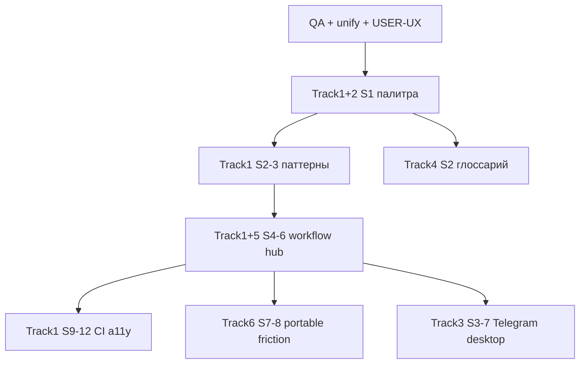

# Идеи развития HH Ai

**Обновлено:** 2026-06-03 · **Операционный план v3:** [IMPROVEMENT-PLAN-2026-06.md](IMPROVEMENT-PLAN-2026-06.md) · [ROADMAP.md](ROADMAP.md) · [DEVELOPMENT-PLAN-2026-06-PHASE2.md](DEVELOPMENT-PLAN-2026-06-PHASE2.md)

Приоритет: **P0** срочно · **P1** следующий спринт · **P2** полезно · **P3** когда будет время  
Усилие: **S** ≤1 д · **M** 2–5 д · **L** >1 нед

---

## 1. Надёжность дашборда

| ID | Идея | P | Effort | Статус |
|----|------|---|--------|--------|
| D-01 | `check:dashboard` — синтаксис + JSDoc + DOM | P0 | S | [x] |
| D-02 | Единая версия `app.js` (`dashboard-asset-version.mjs`) | P0 | S | [x] |
| D-03 | E2E `test:dashboard-settings` в CI | P0 | S | [x] |
| D-04 | Проверка `dashboard-v4.css?v=` в static check | P1 | S | [x] |
| D-05 | Контракт DOM для precheck / letter-hub (id) | P1 | M | [x] |
| D-06 | `pageerror` gate в `devops:test-dashboard-ui` | P1 | S | [x] |
| D-07 | Smoke: импорт всех `app.js` зависимостей (esbuild graph) | P2 | M | [x] |
| D-08 | Pre-commit hook: `check:dashboard` при diff в `dashboard/public/` | P2 | S | [x] |

---

## 2. Модалка «Настройки»

| ID | Идея | P | Effort | Статус |
|----|------|---|--------|--------|
| S-01 | Dirty-индикатор на **всех** вкладках при несохранённом | P1 | S | [x] |
| S-02 | Подсветка вкладки, где меняли поле (per-tab dirty) | P2 | M | [x] |
| S-03 | «Отменить изменения» на вкладке без закрытия модалки | P2 | M | [x] |
| S-04 | Импорт JSON писем из textarea (симметрия export prefs) | P2 | M | [ ] |
| S-05 | Онбординг скрывать после первого успешного батча | P3 | S | [x] |
| S-06 | Поиск по полям настроек (Ctrl+F внутри модалки) | P3 | L | [ ] |
| S-07 | Превью «сколько вакансий отсечёт» при смене таргетинга live | P2 | M | [x] |

---

## 3. Общий UI модалок

| ID | Идея | P | Effort | Статус |
|----|------|---|--------|--------|
| M-01 | `modal-layout.mjs` — Esc, backdrop, реестр модалок | P1 | M | [x] |
| M-02 | Единый `openModal` / `closeModal` stack (сейчас частично в `modals.mjs`) | P1 | M | [x] |
| M-03 | Анимация open/close без layout shift | P3 | S | [ ] |

---

## 4. Качество писем и батч

| ID | Идея | P | Effort | Статус |
|----|------|---|--------|--------|
| L-01 | Precheck → diff prefs «что изменилось с прошлого батча» | P1 | M | [x] |
| L-02 | В hub: тренд FP за 7 дней (мини-график) | P2 | M | [x] |
| L-03 | Авто-предложение golden из reject одной кнопкой | P2 | M | [x] |
| L-04 | Letter score в карточке + фильтр «ниже 6» в один клик | P2 | S | [ ] |
| L-05 | Batch report: ссылка «открыть настройки FP» с focus | P1 | S | [x] |

---

## 5. Распространение и onboarding

| ID | Идея | P | Effort | Статус |
|----|------|---|--------|--------|
| R-01 | Portable ZIP в Releases (R1.2) | P1 | L | [x] 3.2 |
| R-02 | `npm run setup` → открыть дашборд + чеклист FIRST-RUN | P2 | M | [x] partial: `setup:first-run`, install.ps1 |
| R-03 | В Desktop: встроенный `check:dashboard` перед обновлением | P2 | M | [ ] |
| R-04 | Демо-очередь в zip по умолчанию для первого запуска | P2 | S | [x] R-04b/c: API + empty state + install |

---

## 6. Автоматизация и фон

| ID | Идея | P | Effort | Статус |
|----|------|---|--------|--------|
| A-01 | Утренний цикл: отчёт в Telegram с ссылкой `?settings=apply` | P2 | M | [ ] |
| A-02 | Nightly: `quality:check` + уведомление при падении | P1 | S | [x] |
| A-03 | Авто-backup `preferences.json` перед импортом | P2 | S | [x] |
| A-04 | Resume raise + digest в одном «дневном» сценарии | P2 | M | [ ] |

---

## 8. Дизайн-система и единый UI (дашборд)

**План v3.0 (весь продукт):** [DESIGN-SYSTEM-PLAN-2026-06.md](DESIGN-SYSTEM-PLAN-2026-06.md) · **индекс:** [DESIGN-ECOSYSTEM-INDEX.md](DESIGN-ECOSYSTEM-INDEX.md) · **справочник:** [DESIGN-SYSTEM-2026-06.md](DESIGN-SYSTEM-2026-06.md).

| ID | Идея | P | Спринт | Track | Статус |
|----|------|---|--------|-------|--------|
| DS-01 | Рефактор `--v4-*` → `--hh-*` (DS-A1) | P0 | S1 | 1 | [x] |
| DS-02 | Карточки `--cq-*` = ui (DS-A2 / CARD2) | P0 | S1 | 1,2 | [x] |
| DS-03 | Lint hex в dashboard CSS (DS-A4) | P0 | S1 | 1 | [x] |
| DS-04 | Empty state очередь/отчёт (DS-B2) | P1 | S2 | 1 | [x] |
| DS-05 | Status strip в доке (DS-B3) | P1 | S3 | 1 | [x] |
| DS-06 | Workflow 1–4 + подсказки (DS-C1) | P2 | S4 | 1 | [x] |
| DS-07 | Скриншот UI regression (DS-D1) | P3 | S9 | 1 | [x] MVP CI |
| DS-08 | a11y контраст AA (DS-D6) | P2 | S12 | 1 | [x] spot 20 checks |
| DS-09 | `DASHBOARD_STYLE_VERSION` (DS-D5) | P2 | S12 | 1 | [x] |
| DS-10 | `hh-text-*` типографика (DS-A5) | P3 | S2 | 1 | [x] |

---

## 9. Опыт продукта (дорожки 2–6)

| ID | Идея | P | Спринт | Track | Статус |
|----|------|---|--------|-------|--------|
| DS-11 | Слоты действий карточки (CARD3) | P1 | S2 | 2 | [x] fixed foot slots medium |
| DS-12 | Список: empty/skeleton (CARD5) | P1 | S3 | 2 | [x] |
| DS-13 | Telegram deep link в дашборд (CHAN2) | P1 | S3 | 3 | [x] |
| DS-14 | Глоссарий UI RU (VOICE1) | P1 | S2 | 4 | [x] |
| DS-15 | Скрины docs под v4 (VOICE4) | P1 | S5 | 4 | [ ] |
| DS-16 | Воронка modal = unify (DATA1) | P2 | S4 | 5 | [x] |
| DS-17 | Portable demo-очередь (DIST2) | P1 | S8 | 6 | [ ] |
| DS-18 | Friction-прогон внешним (DIST1) | P1 | S7 | 6 | [ ] |
| DS-19 | Desktop pre-build check (CHAN5) | P2 | S7 | 3 | [ ] |
| DS-20 | Live-превью таргетинга (C2) | P1 | S5 | 1 | [x] S-07b MVP |
| DS-21 | Hub тренд FP 7д (C3) | P2 | S6 | 1 | [ ] |
| DS-22 | Фильтр score &lt;6 (C4) | P2 | S6 | 1 | [ ] |
| DS-23 | First-run в дашборде (C5) | P1 | S5 | 1,6 | [x] onboarding + demo CTA |
| DS-24 | Simple/expert режим (C6) | P2 | S6 | 1 | [ ] |
| DS-25 | Шаблоны Telegram (CHAN1) | P2 | S11 | 3 | [ ] |
| DS-26 | Шкала letter metrics в hub (DATA5) | P2 | S6 | 5 | [ ] |
| DS-27 | API-ошибки человекочитаемые (VOICE3) | P1 | S4 | 4 | [x] |
| DS-28 | Цвета статусов карточки (CARD4) | P1 | S2 | 2 | [x] |
| DS-29 | README hero-screenshot (DIST4) | P2 | S8 | 6 | [ ] |
| DS-30 | Job progress = status strip (CHAN7) | P2 | S4 | 3 | [ ] |

---

## 10. Расширение темы (Tracks 7–10, фазы 5–8)

**Стратегия:** [PRODUCT-STRATEGY-2026.md](PRODUCT-STRATEGY-2026.md) · **детали:** [DEVELOPMENT-PLAN-2026-06-PHASE2.md](DEVELOPMENT-PLAN-2026-06-PHASE2.md) v2 §13–22.

| ID | Идея | P | Track | Статус |
|----|------|---|-------|--------|
| AI-01 | «Почему fail» на карточке (human reason) | P2 | 9 | [x] score tooltip |
| AI-05 | KPI «без правки» + action hint | P1 | 9 | [x] click → settings letters |
| CH-01 | Workflow «Следить» + badge чатов | P1 | 7 | [x] menubar + poll |
| CH-02 | Chip «Нужен ответ» на карточке | P2 | 7 | [x] |
| DT-01 | Tray status desktop | P2 | 8 | [ ] |
| DT-02 | First-run wizard в Tauri | P1 | 8 | [ ] |
| MOB-01 | Mobile bar = workflow 1–4 | P2 | 10 | [ ] |
| U-06 | Service drawer accordion (expert blocks) | P2 | 1 | [x] |
| ARCH-01 | План миграции legacy CSS → tokens | P3 | 1 | [ ] |

---

## 7. Метрики продукта

| ID | Идея | P | Effort | Статус |
|----|------|---|--------|--------|
| K-01 | Дашборд KPI: % откликов без правки письма (из feedback.jsonl) | P1 | M | [x] |
| K-02 | Воронка: конверсия invited / applied по неделям | P2 | M | [ ] |
| K-03 | Экспорт CSV воронки для Excel | P3 | S | [ ] |

---

## Рекомендуемый порядок (Q3 2026)

1. **Сделано:** QA, DS-A, UI trim, glossary, Telegram links — см. [PHASE2 §1](DEVELOPMENT-PLAN-2026-06-PHASE2.md#1-базовая-линия).  
2. **Сейчас:** **P0** стабилизация trim → **P1** workflow + preview.  
3. **Параллельно:** funnel colors (DS-16), friction log (DS-18).

---

## Как добавить идею

1. Строка в таблице с новым ID (`X-##`).  
2. При старте работы — статус `[~]`, по merge — `[x]` и ссылка на PR/commit.  
3. Крупные темы — отдельный Issue в GitHub + строка в [issues/BACKLOG.md](issues/BACKLOG.md).
