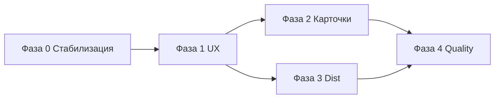
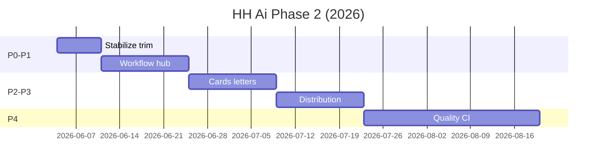
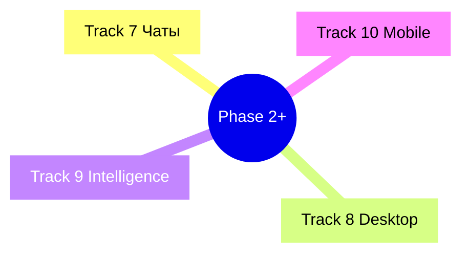
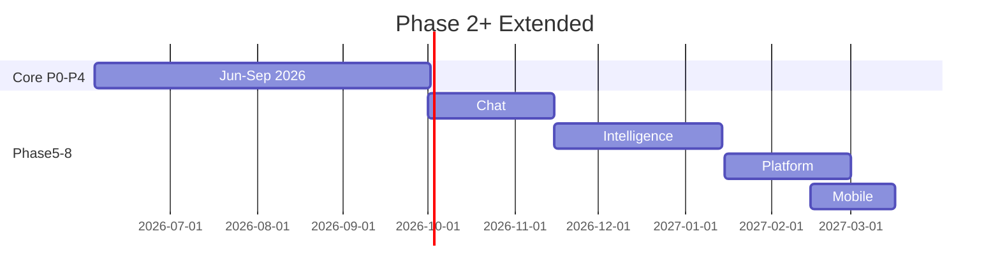

# Подробный план доработок HH Ai (фаза 2+)

**Версия:** 2.0 · **2026-06-03**  
**Горизонт:** июнь 2026 – март 2027 (~40 нед.)  
**North Star:** пользователь за один вечер проходит D0–D5 ([DESIGN-SYSTEM-PLAN](DESIGN-SYSTEM-PLAN-2026-06.md) §4.2) без README и без поломок UI.

**Стратегия:** [PRODUCT-STRATEGY-2026.md](PRODUCT-STRATEGY-2026.md) · **Связано:** [DEVELOPMENT-IDEAS.md](DEVELOPMENT-IDEAS.md) · [DESIGN-SYSTEM-PLAN-2026-06.md](DESIGN-SYSTEM-PLAN-2026-06.md) · [USER-UX-PLAN-2026-06.md](USER-UX-PLAN-2026-06.md) · [ROADMAP.md](ROADMAP.md) Q14–Q18 · [UX-FRICTION-LOG.md](UX-FRICTION-LOG.md)

---

## Оглавление

1. [Базовая линия (что уже сделано)](#1-базовая-линия)
2. [Приоритеты и фазы](#2-приоритеты-и-фазы)
3. [Фаза 0 — Стабилизация после UI trim (1 нед.)](#3-фаза-0--стабилизация)
4. [Фаза 1 — Продуктовый UX дашборда (3 нед.)](#4-фаза-1--продуктовый-ux)
5. [Фаза 2 — Карточки и письма (3 нед.)](#5-фаза-2--карточки-и-письма)
6. [Фаза 3 — Дистрибуция и первый запуск (2 нед.)](#6-фаза-3--дистрибуция)
7. [Фаза 4 — Качество и зрелость (4 нед.)](#7-фаза-4--качество)
8. [Календарь спринтов P0–P6](#8-календарь-спринтов)
9. [Матрица зависимостей](#9-матрица-зависимостей)
10. [Метрики и gates](#10-метрики-и-gates)
11. [Backlog (P2–P3, без срока)](#11-backlog)  
12. [Чеклист «следующие 14 дней»](#12-чеклист-следующие-14-дней)  
13. [Дорожки 7–10 (расширение темы)](#13-дорожки-710)  
14. [Фазы 5–8 (Q4 2026 – Q1 2027)](#14-фазы-58)  
15. [LLM и качество (волна K+)](#15-llm-и-качество)  
16. [Чаты и follow-up (Track 7)](#16-чаты-и-follow-up)  
17. [Desktop, mobile, offline](#17-desktop-mobile-offline)  
18. [Информационная архитектура после trim](#18-информационная-архитектура-после-trim)  
19. [Release train и версии](#19-release-train)  
20. [Расширенный каталог задач](#20-расширенный-каталог)  
21. [Spikes и исследования](#21-spikes)  
22. [Матрица документов](#22-матрица-документов)

---

## 1. Базовая линия

### Сделано (2026-06, можно не трогать)

| Область | Результат |
|---------|-----------|
| QA дашборда | `check:dashboard`, E2E настроек, scorecard 10/10 |
| Дизайн-система S1 | `--hh-*`, lint hex, `DASHBOARD_STYLE_VERSION`, `check:design-tokens` |
| UX plain language | глоссарий, FP-подписи, precheck diff, batch-итог, onboarding hide |
| UI trim | убраны дубли menubar/sync/service/toolbar; одна точка «Сервисы» |
| Каналы | Telegram deep links (batch, harvest), `?batchReport=1`, `api-errors.mjs` |
| Баг | `/api/` vs `/api-errors.mjs` в dashboard-server |

### Известные пробелы после trim

| # | Проблема | Риск |
|---|----------|------|
| T1 | В `preferences.json` у пользователей остались `quickSync` / `serviceLink` в panelOrder | «призрачные» панели в конструкторе |
| T2 | CSS для `.dock-section--sync`, `.service-link` — мёртвые правила | шум в v4.css |
| T3 | Dock-mini слева всё ещё 10+ иконок (частично дублирует workflow) | перегруз при свёрнутой панели |
| T4 | Expert toolbar: только фильтры писем — ок, но нет подсказки «где Поиск» | confusion после trim |
| T5 | `GLOSSARY-UI.md` — 9 терминов, не 30 | неполное покрытие copy |

---

## 2. Приоритеты и фазы



| Фаза | Нед. | Фокус | ROADMAP |
|------|------|-------|---------|
| **0** | 1 | prefs/CSS cleanup, подсказки после trim | Q14 |
| **1** | 3 | workflow, превью таргетинга, hub, funnel colors | Q14–Q15 |
| **2** | 3 | карточки CARD3/5, letter score filter, hub trend | Q15 |
| **3** | 2 | portable demo, setup wizard, friction log | Q16 |
| **4** | 4 | screenshot CI, a11y, docs screens, KPI | Q16 |

**Не параллелить без нужды:** Фаза 0 → затем 1+2 (разные файлы, но 1 блокирует приёмку D4–D5).

---

## 3. Фаза 0 — Стабилизация

**Цель:** после UI trim ничего не «ломается тихо» у существующих пользователей.

### Задачи

| ID | Задача | Дни | Файлы | DoD |
|----|--------|-----|-------|-----|
| **U-01** | Миграция panelOrder: выкинуть `quickSync`, `serviceLink` из сохранённых prefs | 0.5 | `lib/dashboard-preferences.mjs`, `app.js` load | старые prefs не ломают sidebar builder |
| **U-02** | Подсказка при первом заходе после trim (toast 1×): «Поиск и отклики — слева в „Действия“» | 0.5 | `app.js`, `localStorage` key | simple mode, 1 показ |
| **U-03** | Удалить мёртвый CSS sync/service-link в v4/shell | 1 | `dashboard-v4.css`, `dashboard-shell.css` | `check:design-tokens` ok |
| **U-04** | Dock-mini: убрать `routine`/`harvest`/`batch` если workflow активен на том же шаге (опционально collapse) | 1 | `workspace-docks.mjs`, v4 CSS | ≤7 иконок слева в mini |
| **U-05** | Расширить `GLOSSARY-UI` до 25+ терминов + audit оставшихся «FP» в expert UI | 1 | `GLOSSARY-UI.md`, `dashboard-ux.mjs`, `app.js` | grep FP в simple = 0 |

**Gate фазы 0:** `npm run quality:dashboard` · `test:dashboard-settings` · `test-sidebar-builder` · ручной прогон simple/expert 15 мин.

---

## 4. Фаза 1 — Продуктовый UX

**Цель:** закрыть D4–D6 — настройки понятны, workflow ведёт, hub/funnel читаемы.

### 4.1 Workflow и подсказки (DS-C1)

| ID | Задача | Дни | Файлы | DoD |
|----|--------|-----|-------|-----|
| **DS-06** | Контекстные hint под workflow 1–4 (tooltip + strip под menubar при смене шага) | 2 | `ui-workflow.mjs`, `index.html`, v4 CSS | клик «Откликнуться» → approved + scroll к batch |
| **DS-30** | Job progress визуально = status strip (единые chip) | 1 | `dashboard-unify.css`, `job-progress-ui.mjs` | §13.B в DESIGN-SYSTEM-PLAN |

### 4.2 Настройки и precheck (S-07, DS-20)

| ID | Задача | Дни | Файлы | DoD |
|----|--------|-----|-------|-----|
| **S-07** / **DS-20** | Live preview: «≈ N вакансий отсечётся» при смене порога/таргетинга | 3 | `lib/settings-apply-preview.mjs`, `settings-modal.mjs`, API | число обновляется ≤1 с после input |
| **S-04** | Import JSON писем (симметрия export) | 2 | `settings-modal.mjs`, server API | round-trip без потери keys |

### 4.3 Hub и отчёты (DS-21, DS-26, L-02)

| ID | Задача | Дни | Файлы | DoD |
|----|--------|-----|-------|-----|
| **DS-21** / **L-02** | Hub: sparkline FP / letter pass за 7 дней | 3 | `letter-quality-ui.mjs`, API aggregate | мини-график в hub modal |
| **DS-26** | Шкала 0–10 с подписью «качество письма» | 1 | hub modal, `GLOSSARY-UI` | одна легенда |
| **L-05** | Batch report → focus на letter settings (уже [x], проверить после trim) | 0.5 | regression only | E2E click |

### 4.4 Воронка (DS-16, K-02)

| ID | Задача | Дни | Файлы | DoD |
|----|--------|-----|-------|-----|
| **DS-16** | Funnel modal: цвета/типографика unify | 2 | `funnel-charts.mjs`, v4/unify CSS | как правый KPI dock |
| **K-02** | Конверсия invited/applied по неделям в stats-grid | 2 | `offers-stats.mjs`, `app.js` | число + мини-trend |

**Gate фазы 1:** сценарий D4–D6 за ≤30 мин новым пользователем (maintainer checklist); §13.C пункты C4–C7.

---

## 5. Фаза 2 — Карточки и письма

**Цель:** три плотности карточек без скачков; letter score виден в списке.

| ID | Задача | Дни | Файлы | DoD |
|----|--------|-----|-------|-----|
| **DS-11** / **CARD3** | Выровнять слоты hh›× на 3 плотностях | 2 | `card-tiles.mjs`, `dashboard-card-tiles.css` | §13.B B1–B3 |
| **DS-12** / **CARD5** | Skeleton при load, empty без layout jump | 2 | `app.js`, unify CSS | нет CLS при смене плотности |
| **DS-22** / **L-04** | Фильтр «письмо &lt;6» одним кликом + badge на карточке | 2 | `card-tiles.mjs`, toolbar filter | связь с `btn-filter-letter-quality` |
| **L-03** | Golden из reject — кнопка на карточке отклонённой | 2 | `app.js`, API suggest | 1 клик → prefs diff preview |
| **DS-24** | Simple/expert: скрыть letter-center panel actions в simple | 1 | v4 CSS, presets | expert-only regen/fixable |

**Gate:** CARD-DESIGN-SYSTEM чеклист + 3 плотности в `test-dashboard-ui`.

---

## 6. Фаза 3 — Дистрибуция

**Цель:** D0 ≤45 мин, portable без страха.

| ID | Задача | Дни | Файлы | DoD |
|----|--------|-----|-------|-----|
| **R-04** / **DS-17** | Demo-очередь 10 вакансий в public zip | 2 | `release:public`, `data/demo/` | FIRST-RUN не пустой список |
| **R-02** / **DS-23** | `npm run setup` → dashboard + 4 шага в консоли | 2 | `scripts/setup.mjs`, FIRST-RUN | qa:clean-install подсказки |
| **DS-18** | Friction-прогон внешним → UX-FRICTION-LOG +5 строк | 1 | docs, Issues | ≥3 actionable |
| **DS-29** | README hero-screenshot актуальный | 0.5 | README, `docs/screenshots/` | дата &lt;30 дней |
| **R-01** | Portable ZIP в Releases (если не blocked Tauri) | 5 | CI release workflow | скачивание без git |

**Gate:** `qa:clean-install` + новый тестер проходит QUICKSTART ≤45 мин.

---

## 7. Фаза 4 — Качество

| ID | Задача | Дни | Файлы | DoD |
|----|--------|-----|-------|-----|
| **DS-07** | Screenshot regression (Playwright, 10 экранов) | 5 | `scripts/test-dashboard-screenshots.mjs`, CI | diff &lt;1% или approve |
| **DS-08** | a11y контраст AA (spot check + fix tokens) | 3 | tokens, unify | axe или ручной чеклист |
| **DS-15** | Docs screenshots v4 (5 шт.) | 2 | QUICKSTART, DASHBOARD | визуал = prod |
| **DS-19** / **R-03** | Desktop: pre-build `check:dashboard` | 1 | Tauri CI | fail build if UI broken |
| **DS-25** | Telegram templates v2 (digest, error, batch) | 2 | `batch-notify`, `daily-digest` | 3 шаблона по глоссарию |
| **K-01** | KPI «% без правки письма» в правом доке | 2 | `feedback.jsonl`, stats | число обновляется daily |
| **K-03** | CSV export воронки | 0.5 | `funnel-export.mjs` | уже частично — polish |
| **M-03** | Modal animate без layout shift | 1 | `modal-layout.mjs`, CSS | нет jump при open |

**Gate:** `verify:local` перед тегом; ROADMAP Q14–Q16 → [x].

---

## 8. Календарь спринтов

| Спринт | Неделя | Фокус | ID задач |
|--------|--------|-------|----------|
| **P0** | 1 | Стабилизация trim | U-01…U-05 |
| **P1** | 2 | Workflow + job strip | DS-06, DS-30 |
| **P2** | 3 | Preview таргетинга | S-07, DS-20 |
| **P3** | 4 | Hub + funnel | DS-21, DS-26, DS-16 |
| **P4** | 5–6 | Карточки | DS-11, DS-12, DS-22 |
| **P5** | 7–8 | Письма + golden | L-03, L-04, DS-24 |
| **P6** | 9–10 | Dist + friction | R-04, R-02, DS-18, DS-23 |
| **P7** | 11–14 | Quality + release | DS-07, DS-08, DS-15, K-01 |



---

## 9. Матрица зависимостей

| Задача | Блокирует | Зависит от |
|--------|-----------|------------|
| S-07 preview | DS-06 workflow «Разобрать» | API preview (есть) |
| DS-22 letter filter | L-04 | letter score в queue JSON |
| R-01 portable | DS-17 demo queue | release pipeline |
| DS-07 screenshots | — | UI freeze после P1–P3 |
| DS-18 friction | R-02 setup | внешний тестер |
| U-01 prefs migration | sidebar builder | — |

---

## 10. Метрики и gates

### Продуктовые (из DESIGN-SYSTEM-PLAN §13.D)

| Метрика | Сейчас | Цель P6 | Как мерить |
|---------|--------|---------|------------|
| Time to first batch (D0–D5) | — | ≤45 мин | friction log + секундомер |
| Dashboard check CI | green | always | push/PR |
| Glossary coverage toasts | ~40% | 90% | audit script |
| Doc screenshot age | stale | &lt;90 дней | дата в README |
| Friction log entries | 5 maintainer | +10 внешних | UX-FRICTION-LOG |
| Отклики без правки письма | — | ≥60% | K-01 |

### Технические gates (каждый PR UI)

1. `npm run quality:dashboard`
2. ID задачи (U-/DS-/S-/L-/R-) в описании
3. CHANGELOG [Unreleased] при user-visible
4. Ctrl+F5 note если менялся cache-bust

---

## 11. Backlog

Без жёсткого срока — брать после P7 или по боли пользователя.

| ID | Тема | P |
|----|------|---|
| S-06 | Поиск по полям в настройках | P3 |
| A-01 | Telegram утренний цикл + deep link settings | P2 |
| A-04 | Resume raise + digest один сценарий | P2 |
| DS-10 | доп. уровни `hh-text-*` в legacy style.css | P3 |
| Tauri polish | см. [TAURI-PLAN.md](TAURI-PLAN.md) | P2 |
| Captcha UX screen | единый alert Playwright | P3 |
| CLI цветной вывод npm scripts | Track 4 | P3 |

---

## 12. Чеклист «следующие 14 дней»

Порядок выполнения без обсуждений:

- [x] **U-01** — миграция prefs (quickSync/serviceLink)
- [x] **U-02** — toast «где Поиск» после trim
- [x] **U-03** — удалить мёртвый CSS
- [x] **DS-06** — workflow hints
- [x] **S-07** — live preview порога (MVP: minScore)
- [x] **DS-16** — funnel modal colors
- [ ] Прогон **test:dashboard-integration** после каждого блока
- [ ] Обновить статусы в [DEVELOPMENT-IDEAS.md](DEVELOPMENT-IDEAS.md)
- [ ] 1 строка в UX-FRICTION-LOG после self-test simple mode

**Оценка:** ~8–10 dev-дней при фокусе на P0+P1.

---

## 13. Дорожки 7–10

Дополнение к [DESIGN-SYSTEM-PLAN v3](DESIGN-SYSTEM-PLAN-2026-06.md) §3 — темы за пределами «chrome + dist».



| Track | Название | Горизонт | Связь |
|-------|----------|----------|-------|
| **7** | Чаты & follow-up | Q4 2026 | [CHAT-INBOX-PLAN](CHAT-INBOX-PLAN.md) |
| **8** | Desktop & installer | Q4 2026 | [TAURI-PLAN](TAURI-PLAN.md) |
| **9** | Intelligence loop | Q1 2027 | [COVER-LETTER-PLAN](COVER-LETTER-PLAN.md) фаза K+ |
| **10** | Mobile & narrow | Q1 2027 | `ui-mobile.mjs`, mobile-bar |

---

## 14. Фазы 5–8

| Фаза | Когда | Фокус | Gate |
|------|-------|-------|------|
| **5** Chat-native | окт–ноя 2026 | inbox в workflow «Следить», badge, Telegram /chats polish | CH-04 E2E |
| **6** Intelligence | ноя 2026 – янв 2027 | auto-suggest rules, style learning UI, weekly digest KPI | AI-05 metric |
| **7** Platform | янв–фев 2027 | Tauri auto-update, bundled chromium option, desktop check in CI | R-03 [x] |
| **8** Mobile polish | фев–мар 2027 | mobile sheets, touch targets 44px, card swipe actions | MOB-03 audit |



---

## 15. LLM и качество

Продолжение [COVER-LETTER-PLAN](COVER-LETTER-PLAN.md) — фаза **K+** (после hub/precheck).

| ID | Задача | Дни | DoD |
|----|--------|-----|-----|
| **AI-01** | «Почему fail» — 1 строка human reason на карточке (из assess) | 2 | tooltip на score badge |
| **AI-02** | Weekly letter report в digest (pass rate, top fail reasons) | 2 | daily-digest section |
| **AI-03** | A/B preset писем: сравнение 2 пресетов на golden set | 3 | report JSON |
| **AI-04** | User-edits → auto snippet suggest (opt-in) | 3 | L-03 synergy |
| **AI-05** | Dashboard KPI «% без правки» → action hint («поднять порог retry») | 2 | K-01 + CTA |
| **AI-06** | Batch: «skip letter regen if score ≥8» toggle in precheck | 1 | prefs + meter |

**Принцип:** LLM дорогой — UI показывает **результат проверки без LLM** (`letter-quality.mjs`) везде, где можно.

---

## 16. Чаты и follow-up

| ID | Задача | Дни | Файлы | DoD |
|----|--------|-----|-------|-----|
| **CH-01** | Workflow «Следить» → applied + badge unread chats | 1 | `ui-workflow.mjs`, menubar | число на шаге 4 |
| **CH-02** | Карточка: chip «Нужен ответ» если needsReply | 2 | `card-tiles.mjs`, chat matcher | клик → inbox thread |
| **CH-03** | Inbox: unify modal styles (DS-16 parity) | 1 | chat modal CSS | funnel-like |
| **CH-04** | E2E smoke: open inbox, draft, mark sent (mock) | 2 | `test-chat-inbox.mjs` | CI optional |
| **CH-05** | Telegram: digest включает «N чатов ждут ответа» + deep link | 1 | `daily-digest.mjs` | CHAN1 subset |
| **CH-06** | Follow-up scheduler UI в service drawer (не expert-only) | 2 | settings/service | readable slots |

Backlog CHAT-PLAN: WebSocket вместо polling — **CH-07** (L, Q2 2027).

---

## 17. Desktop, mobile, offline

### Desktop (Track 8)

| ID | Задача | Дни | DoD |
|----|--------|-----|-----|
| **DT-01** | Tray icon: status harvest/batch idle/running | 2 | Tauri |
| **DT-02** | First-run wizard в desktop (Chromium + login checklist) | 3 | replaces terminal |
| **DT-03** | Auto-update channel (optional, off by default) | 5 | TAURI-PLAN backlog |
| **DT-04** | `desktop:check` включает `quality:dashboard` | 0.5 | DS-19 |

### Mobile (Track 10)

| ID | Задача | Дни | DoD |
|----|--------|-----|-----|
| **MOB-01** | Mobile bar: 4 пункта = workflow 1–4 | 2 | `ui-mobile.mjs` |
| **MOB-02** | Sheets: actions без duplicate desktop docks | 2 | index.html |
| **MOB-03** | Touch targets ≥44px audit | 1 | design tokens |
| **MOB-04** | Card swipe: defer / reject (optional) | 3 | gesture |

### Offline / resilience

| ID | Задача | Дни | DoD |
|----|--------|-----|-----|
| **OFF-01** | Dashboard offline banner + retry queue actions | 1 | COPY.errDashboardOffline |
| **OFF-02** | Batch resume после crash browser (UI state) | 2 | batch-control |

---

## 18. Информационная архитектура после trim

Целевая схема (обновить [DESIGN-PLAN.md](DESIGN-PLAN.md) §2):

```
Menubar
├── Brand (reload)
├── Workflow 1–4          ← главная навигация сценария
└── Tools: docks · Сервисы · Настройки · ? · Журнал

Left dock «Управление»
├── Онбординг (до 1-го batch)
├── Статус + лимиты + letter mini
├── Действия (+ Сервисы…)
├── Период harvest
├── Разделы очереди
└── Фильтры (expert)

Center
├── Search + breadcrumbs
├── Card density (Краткий/Средний/Полный)
└── List viewport

Right dock «Сводка»
├── Подъём резюме
├── Синхронизация hh.ru      ← единственное место sync-кнопок
├── Резюме / рутина (expert)
├── KPI + funnel mini
├── Ложные пропуски
└── Job progress + controls

Overlays
├── Settings (5 tabs)
├── Service drawer (все пакеты)
├── Batch precheck / report
├── Letter hub / funnel / chats
```

**UI trim v2 (backlog U-06…U-10):**

| ID | Задача |
|----|--------|
| U-06 | Свернуть expert-only блоки в service drawer accordion |
| U-07 | Letter-center panel → только клик по stats, не always-on |
| U-08 | Объединить «Рутина» и «Утренний цикл» copy |
| U-09 | Command palette: группы по workflow step |
| U-10 | Settings: «Простой» скрывает appearance builder |

---

## 19. Release train

См. [PRODUCT-STRATEGY §8](PRODUCT-STRATEGY-2026.md#8-release-train-2026-h2).

| Версия | Фазы | User-visible |
|--------|------|--------------|
| 3.0.6 | P0 | Стабильность после trim, toast |
| 3.1.0 | P1 | Workflow hints, preview порога |
| 3.2.0 | P2 | Карточки, letter filter |
| 3.3.0 | P3 | Demo queue, setup |
| 3.4.0 | P4 | Screenshot CI, a11y |
| 3.5.0 | 5 | Chat badge, inbox polish |
| 3.6.0 | 6 | Intelligence KPI, digest |
| 3.7.0 | 7–8 | Desktop tray, mobile bar |

**Правило:** patch (3.0.x) — только fix; minor — фазы; major — breaking prefs/API.

---

## 20. Расширенный каталог

Полный реестр ID для PR (дополнение к DEVELOPMENT-IDEAS §8–9).

| ID | Название | Track | P | Фаза |
|----|----------|-------|---|------|
| U-01…U-05 | Stabilize trim | 1 | P0 | P0 |
| U-06…U-10 | IA trim v2 | 1 | P2 | post-P4 |
| DS-06…DS-30 | Design system | 1–5 | mixed | P1–P4 |
| S-04, S-07 | Settings | 1 | P1–P2 | P1–P2 |
| L-02…L-05 | Letters | 2,9 | P1–P2 | P1–P2 |
| R-01…R-04 | Release | 6 | P1–P2 | P3 |
| K-01…K-03 | Metrics | 5 | P1–P3 | P4 |
| AI-01…AI-06 | Intelligence | 9 | P2 | 6 |
| CH-01…CH-07 | Chats | 7 | P1–P3 | 5 |
| DT-01…DT-04 | Desktop | 8 | P2 | 7 |
| MOB-01…MOB-04 | Mobile | 10 | P2 | 8 |
| OFF-01…OFF-02 | Resilience | — | P2 | 6 |
| ARCH-01 | CSS layers merge (style → tokens migration plan) | 1 | P3 | 8 |
| ARCH-02 | `dashboard-server` route `/api/` registry doc | — | P3 | 7 |

---

## 21. Spikes

Короткие исследования перед крупными задачами:

| Spike | Вопрос | Дни | Артефакт |
|-------|--------|-----|----------|
| SP-01 | Live preview: client-only vs API roundtrip | 1 | decision in S-07 PR |
| SP-02 | Screenshot CI: Playwright vs lost-pixel | 1 | DS-07 approach |
| SP-03 | WebSocket для chat inbox feasibility | 2 | CH-07 go/no-go |
| SP-04 | Bundled Chromium size in installer | 1 | DT-03 estimate |
| SP-05 | Card swipe on desktop (need?) | 0.5 | MOB-04 cancel? |

---

## 22. Матрица документов

| Вопрос | Документ |
|--------|----------|
| Зачем продукт? | [PRODUCT-STRATEGY-2026.md](PRODUCT-STRATEGY-2026.md) |
| Что кодить в июне? | §12 этот файл |
| Как выглядит UI? | [DESIGN-SYSTEM-2026-06.md](DESIGN-SYSTEM-2026-06.md) |
| ID в backlog? | [DEVELOPMENT-IDEAS.md](DEVELOPMENT-IDEAS.md) |
| Письма / LLM? | [COVER-LETTER-PLAN.md](COVER-LETTER-PLAN.md) |
| Чаты? | [CHAT-INBOX-PLAN.md](CHAT-INBOX-PLAN.md) |
| Desktop? | [TAURI-PLAN.md](TAURI-PLAN.md) |
| Plain language? | [USER-UX-PLAN](USER-UX-PLAN-2026-06.md) + [GLOSSARY-UI](GLOSSARY-UI.md) |
| Friction? | [UX-FRICTION-LOG.md](UX-FRICTION-LOG.md) |
| KPI / воронка? | [DESIGN-PLAN.md](DESIGN-PLAN.md) |
| Индекс всего | [DESIGN-ECOSYSTEM-INDEX.md](DESIGN-ECOSYSTEM-INDEX.md) |

---

## История

| Версия | Дата | Изменение |
|--------|------|-----------|
| 1.0 | 2026-06-03 | Фаза 2 после DS v3 + UI trim; P0–P7 |
| 2.0 | 2026-06-03 | **Расширение:** Tracks 7–10, фазы 5–8, LLM/Chat/Desktop/Mobile, IA, release train, каталог 60+ ID, spikes |
