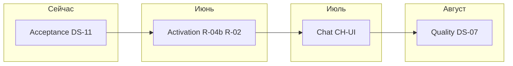

# План улучшений HH Ai (v3)

**Версия:** 3.0 · **2026-06-03**  
**North Star:** D0→D5 (первый осмысленный отклик) за **≤45 мин** без README.  
**Связано:** [PRODUCT-STRATEGY-2026.md](PRODUCT-STRATEGY-2026.md) · [DEVELOPMENT-PLAN-2026-06-PHASE2.md](DEVELOPMENT-PLAN-2026-06-PHASE2.md) · [DEVELOPMENT-IDEAS.md](DEVELOPMENT-IDEAS.md)

---

## 1. Резюме (одна страница)

| | |
|---|---|
| **Где мы** | **3.2.0 release-ready**: R-01/R1.4 zip в CI, gates, demo+chat. Backlog: DS-18 внешний friction, human QUICKSTART ≤45 мин. |
| **Главный рычаг** | Внешний friction (DS-18) + первый batch (D5) |
| **Не трогать** | Tauri wizard, mobile swipe, ARCH-01 |
| **Следующий шаг** | tag **v3.2.0** → внешний тестер → train **3.3.0** |



---

## 2. Снимок зрелости (честный)

### ✅ Готово (не планировать заново)

- QA: `check:dashboard`, design-tokens, E2E settings/integration
- UX: simple/expert, trim menubar/sidebar, workflow hint strip
- Письма: hub sparkline, фильтр «Письмо &lt;6», KPI «Без правки», golden из reject
- Настройки: dirty per-tab, precheck diff, **MVP** live preview minScore (S-07)
- KPI: K-01, K-02 в stats-grid (`letter-apply-kpi`, `conversion-weekly`)
- Dist частично: demo в zip как `data/vacancies-queue.example.json` (R-04a)

### ❌ Критические пробелы (осталось)

| ID | Пробел | Боль пользователя |
|----|--------|-------------------|
| **DS-18** | Friction внешним тестером | слепые зоны UX |
| **R-01** | Portable ZIP в Releases | нет «скачал и работает» без Node |
| **QUICKSTART ≤45m** | Не замерен формально | North Star не подтверждён |

### ✅ Закрыто в v3 (2026-06-03)

| ID | Статус |
|----|--------|
| R-04b/c | demo API + empty state + install scripts |
| R-02 | `setup:first-run`, install.ps1/sh |
| CH-UI | модалка inbox + badge |
| DS-11 | слоты карточек (test-dashboard-ui) |
| A-DOC / A-MET | docs sync + metrics-baseline |
| AI-01/05, S-07b, U-06 | hints, KPI click, targeting preview, accordion |

### ⚠️ MVP vs Full (не смешивать)

| Задача | MVP (есть) | Full (backlog) |
|--------|------------|----------------|
| S-07 preview | minScore в settings | все правила таргетинга live |
| R-04 demo | example.json + install auto-load | replace confirm в UI |
| CH-04 | lib + API + **модалка inbox** | push / Telegram deep link |
| Live preview | порог балла | FP guard + keywords + remote |

---

## 3. Три потока (вместо 10 tracks параллельно)

| Поток | Фокус | Владелец спринта | Stop rule |
|-------|--------|------------------|-----------|
| **P — Product** | Activation, chat UI, intelligence lite | 70% времени | Gate B не пройден → только P |
| **H — Hygiene** | DS-11, doc sync, baseline, friction log | 20% | каждый PR с UI |
| **Q — Quality** | Screenshot CI, a11y, portable release | 10% → 50% после Gate B | не начинать DS-07 до Gate B |

---

## 4. Фазы v3

### Фаза 0 — Acceptance (неделя 1)

**OKR:** список карточек визуально стабилен; docs = код; есть baseline метрик.

| ID | Задача | S/M/L | DoD |
|----|--------|-------|-----|
| A-ACC-1 | **DS-11** слоты карточек | M | `test-dashboard-ui`: compact/medium/full без ошибок футера |
| A-DOC-1 | Sync DEVELOPMENT-IDEAS + PHASE2 §12 | S | L-04, S-04, K-01/02, DS-12/21–24 → [x] |
| A-MET-1 | `scripts/metrics-baseline.mjs` | S | JSON: noEditPct, inviteWeek, queueSize; без PII |
| A-QA-1 | Friction self-test 30 мин → UX-FRICTION-LOG | S | ≥3 actionable строки |

**Gate 0:** `npm run quality:dashboard` + integration + baseline artifact.

---

### Фаза 1 — Activation (недели 2–3)

**OKR:** новый пользователь видит карточки ≤5 мин; путь до первого batch документирован ≤45 мин.

| ID | Задача | S/M/L | DoD |
|----|--------|-------|-----|
| **R-04b** | Пустая очередь → CTA «Загрузить демо» (10 вакансий) | S | без `--queue-file`; toast + кнопка в empty state |
| R-04c | Portable: FIRST-RUN копирует example → queue **или** default prefs `useDemoOnEmpty` | S | `qa:clean-install` A10 |
| **R-02** | `scripts/setup.mjs` + npm script | M | Node check → defaults → optional demo → dashboard |
| DS-23 | First-run карточка (login → demo → approve → batch) | M | onboarding progress 4/4 |
| DS-29 | README hero + `capture-demo-screenshots` | S | дата &lt;30 дней |
| DS-18 | Friction **внешним** тестером | S | +5 строк в UX-FRICTION-LOG |

**Gate B (критический):**

- [x] Автопроверка: `npm run gate-b` — demo visible ≤5 мин (`data/gate-b-last.json`)
- [ ] QUICKSTART пройден ≤45 мин (секундомер + лог) — **внешний friction (DS-18)**
- [x] Нет блокеров P0 в friction log (self-test 2026-06-03)

**Gate C:** [x] `npm run test:chat-inbox-ui` — inbox → thread → mark sent

**Gate D:** [x] AI-01/05, S-07b, U-06 в коде + E2E a11y

**Gate E (partial):** [x] DS-07 MVP + DS-08 spot; [ ] R-01 portable Releases

**Kill criteria:** если Gate B не за 3 недели — упростить R-02 до «copy example.bat» без wizard.

---

### Фаза 2 — Chat surface (недели 4–5, старт только при Gate B ≥80%)

**OKR:** workflow «Следить» связан с чатами; 1 thread обработан из UI.

| ID | Задача | S/M/L | DoD |
|----|--------|-------|-----|
| CH-UI-1 | Модалка inbox + entry (Сервисы / «Следить») | M | список threads |
| CH-UI-2 | Draft + mark sent | S | POST API |
| CH-01 | Badge unread на workflow / stats | S | число из API |
| CH-02 | Chip «Нужен ответ» на applied-карточке | M | клик → thread |

**Gate C:** E2E integration: open inbox → thread → mark sent (demo data).

---

### Фаза 3 — Intelligence lite (недели 5–6, параллельно с хвостом C)

**OKR:** после FP пользователь знает *что* менять без README.

| ID | Задача | S/M/L | DoD |
|----|--------|-------|-----|
| AI-01 | «Почему отсеяно» на score (plain RU) | M | simple mode |
| AI-05 | KPI «Без правки» → CTA в настройки писем | S | focus tab letters |
| S-07b | Live preview полного таргетинга | L | debounce 1 с |
| U-06 | Service drawer accordion | S | expert blocks collapse |

**Gate D:** persona «Аккуратный» проходит D4 за ≤20 мин (checklist maintainer).

---

### Фаза 4 — Quality lock (недели 7–10, после Gate B)

**OKR:** регрессии UI ловятся CI; portable в Releases.

| ID | Задача | S/M/L | DoD |
|----|--------|-------|-----|
| DS-07 | Screenshot regression 10 экранов | L | CI + approve |
| DS-08 | a11y spot (focus, contrast) | M | чеклист 20 пунктов |
| DS-15 | Docs screenshots ×5 | S | QUICKSTART = prod |
| R-01 | Portable ZIP Releases | L | без git clone |
| DS-19 | Desktop pre-build check | S | Tauri optional |

**Gate E:** `verify:local` + screenshot CI → tag **3.3.0**.

---

### Фаза 5+ (Q4 2026 – Q1 2027)

| Track | Вход только если | Ключевое |
|-------|------------------|----------|
| 7 Чаты+ | Gate C | CH-05 digest, CH-06 follow-up UI |
| 8 Desktop | Gate B + R-01 | DT-02 wizard, DT-01 tray |
| 9 Intelligence | baseline 30 д | AI-02 digest, AI-03 A/B |
| 10 Mobile | DS-07 @900px | MOB-01 workflow bar |

**Отложено до 2027:** S-06, MOB-04 swipe, ARCH-01, DT-03 auto-update, CH-07 WebSocket.

---

## 5. Критический путь (CP)

```
DS-11 (1–2d) → R-04b (1d) → R-02 (2d) → Gate B → CH-UI-1 (3d) → DS-07 (5d) → R-01 (3d)
                  ↑
            блокирует 80% ценности D0
```

**Параллельно с CP (не блокирует):** A-DOC-1, A-MET-1, U-06, AI-01.

---

## 6. Календарь 90 дней

| Неделя | Product | Hygiene | Quality | Milestone |
|--------|---------|---------|---------|-----------|
| 1 | — | DS-11, A-DOC, A-MET | — | Gate 0 |
| 2 | R-04b, R-04c | friction self | — | demo visible |
| 3 | R-02, DS-23 | DS-29 | — | **Gate B** |
| 4 | CH-UI-1 | — | — | inbox list |
| 5 | CH-UI-2, CH-01, CH-02 | — | — | Gate C |
| 6 | AI-01, AI-05 | doc sync | — | intelligence lite |
| 7–8 | S-07b, U-06 | baseline review | DS-07 draft | — |
| 9–10 | — | DS-15 | DS-08, R-01 | **Gate E** |

---

## 7. Метрики и gates

### North Star metrics

| Метрика | Baseline (A-MET-1) | Цель Q3 | Инструмент |
|---------|-------------------|---------|------------|
| Time to first card | ? | **≤5 мин** | friction log |
| D0→D5 (first batch) | ? | **≤45 мин** | QUICKSTART секундомер |
| % без правки письма | snapshot | **trend ↑** | `letter-apply-kpi` |
| Invite rate / week | snapshot | baseline + X п.п. | `conversion-weekly` |
| Friction (внешние) | 0 | **≥10** | UX-FRICTION-LOG |
| CI dashboard | green | always | push/PR |

### PR gate (каждый UI PR)

1. `npm run quality:dashboard`
2. ID задачи в описании (A-/R-/CH-/DS-/AI-)
3. CHANGELOG [Unreleased] если user-visible
4. bump cache-bust если `app.js` / v4 CSS

---

## 8. Release train (реалистичный)

| Версия | Когда | Содержание | Gate |
|--------|-------|------------|------|
| **3.0.6** | сейчас | trim v2, job-control | quality + E2E ✅ |
| **3.1.0** | +2 нед | R-04b/c, DS-23, DS-11 | demo on empty |
| **3.2.0** | +4 нед | R-02, CH-UI MVP | Gate B + C partial |
| **3.3.0** | +8 нед | DS-07, R-01 | screenshot CI |
| **3.4.0** | Q4 | Track 7 polish | CH E2E in CI |
| **3.5.0** | Q1 27 | DT-02 desktop | Gate B |

---

## 9. Risk register

| Риск | P×I | Mitigation |
|------|-----|------------|
| Пустая очередь | H×H | **R-04b** #1 priority |
| Doc drift | H×M | A-DOC-1 каждый спринт |
| Solo WIP overflow | H×H | max 2 потока; kill MOB/ARCH |
| E2E flaky | M×M | demo queue в CI; evaluate click |
| hh.ru selectors | M×H | не смешивать с UI спринтом |
| FIRST-RUN обещает setup | H×M | R-02 или правка FIRST-RUN.md |
| 60% no-edit без данных | M×M | A-MET-1 до цели |

---

## 10. Quick wins (&lt;1 день, высокий ROI)

| # | Задача | ROI |
|---|--------|-----|
| 1 | **R-04b** demo on empty | снимает главную боль D0 |
| 2 | A-DOC-1 sync statuses | правильные приоритеты |
| 3 | AI-05 KPI → CTA | замыкает loop качества |
| 4 | CH-01 badge unread | «Следить» оживает |
| 5 | U-06 service accordion | меньше шума в drawer |
| 6 | Правка FIRST-RUN если R-02 задержится | честность docs |

---

## 11. Персоны → один next step

| Персона | Следующий шаг в плане |
|---------|------------------------|
| Новичок | R-04b → R-02 → DS-23 |
| Аккуратный | AI-01 → S-07b |
| Охотник | DS-11 → CH-UI → DS-07 |
| Переговорщик | CH-UI → CH-02 → CH-05 |
| Мейнтейнер | A-DOC-1 → A-MET-1 → DS-07 |

---

## 12. Decision log (шаблон)

| Дата | Решение | Альтернатива | Почему |
|------|---------|--------------|--------|
| 2026-06-03 | v3: Activation перед Quality CI | DS-07 первым | ROI D0 выше |
| 2026-06-03 | WIP=2 потока | 4 tracks параллельно | solo capacity |
| — | R-04b before R-01 | full release first | empty queue блокирует всё |

---

## 13. Чеклист «начать завтра»

- [x] **DS-11** — card slots 3 densities
- [x] **R-04b** — empty state → load demo API/UI
- [x] **A-DOC-1** — 15 статусов в DEVELOPMENT-IDEAS
- [x] **A-MET-1** — baseline script
- [x] Зафиксировать Gate B дату в ROADMAP Q16 (2026-06-03, `npm run gate-b`)

---

*Обновлять при закрытии gate или смене приоритета. Diff v2→v3: три потока P/H/Q, критический путь, MVP/Full таблица, kill criteria Gate B, decision log.*
