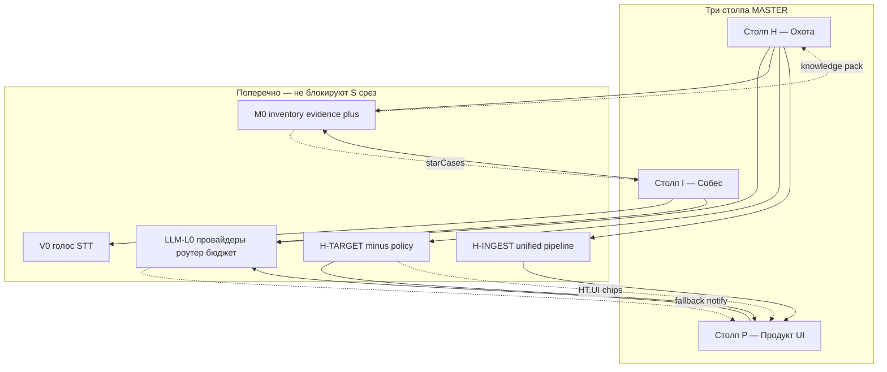

# MASTER-ROADMAP — единая дорожная карта HH Ai

> **Единственный канон «где мы»:** блок **«Где мы»** ниже.  
> **Как читать всю документацию (партнёр):** [`GUIDE-PARTNER.md`](GUIDE-PARTNER.md).  
> Детали: `HANDOFF-*.md` · код A/B/C → [`MEGA-PLAN-NORTH-STAR.md`](MEGA-PLAN-NORTH-STAR.md) · UI v8 → `ui_north_star_v8` · **LLM** → [`LLM-ROADMAP.md`](LLM-ROADMAP.md) · **мультимодальность** → [`MULTIMODAL-ROADMAP.md`](MULTIMODAL-ROADMAP.md) · **таргетинг** → [`TARGETING-ROADMAP.md`](TARGETING-ROADMAP.md) · **HH API harvest** → [`HH-INGEST-ROADMAP.md`](HH-INGEST-ROADMAP.md)

**Обновлено:** 20.07.2026 (pain-wave1: hygiene + UI «к отклику» + letter metrics · [`SESSION-2026-07-20-pain-wave1.md`](SESSION-2026-07-20-pain-wave1.md)) · 20.07.2026 (ретро-фиксы H) · 19.07.2026 (TG HR+captcha) · 18.07.2026 вечер

---

## Где мы

| Поле | Значение |
|------|----------|
| **Фаза** | ПОДГОТОВКА → **ЗАПУСК 25.06** |
| **Срез MASTER** | **S1** ✅ → **S2** ▶ (micro-CTA + drawer + **S2.1 подсказка балла**) |
| **Треки кода** | A + B + C2 + волны 4/D/E — **done** · UI v8 / волна F — **S6/S7** |
| **Режим LLM** | **L2-dslab** primary; **L0.1** 17/135 готовых ✅ P0 |
| **Режим M0** | **M0.1** inventory ✅ · **M0.2** messaging baseline ✅ · **HT.5 devops CV** ✅ · **S2.1** подсказка балла (i) ✅ |
| **H-TARGET** | **HT.0** ✅ · **HT.UI-1** ✅ · **HT.1a** ✅ · **HT.1b** ✅ (код) · **HT.1** wrapper ✅ · **HT.3** suggest→golden ⬜ · **HT.UI-2** hard/soft/match ▶ |
| **H-INGEST** | Harvest backend: **playwright** (HI.0 probe ✅ · HI.1 ⬜) | [`HH-INGEST-ROADMAP.md`](HH-INGEST-ROADMAP.md) |
| **B-HUNT-BASKET** | **B0–B6 ✅** + DoD e2e [`APPLY-CHAIN-STABLE`](APPLY-CHAIN-STABLE.md) · exit 9 pre-submit · pack-ship repair×1 · **resume quiz-gate P0+P1+P2** ✅ | [`B-HUNT-BASKET-ROADMAP.md`](B-HUNT-BASKET-ROADMAP.md) · [`SESSION-2026-07-18-resume-quiz-gate.md`](SESSION-2026-07-18-resume-quiz-gate.md) |
| **Harvest stability** | Checkpoint scoring ✅ · watchdog · **Emil harvest через `--instance=emil`** ✅ (17.07) | [`HUNT-ARCHITECTURE.md`](HUNT-ARCHITECTURE.md) |
| **Голос / STT** | Whisper **small prod** (до A2 L-B v5) · GigaAM 1e A1 ✅ **9/10** · I-track: [`COPILOT-I-TRACK-ROADMAP.md`](COPILOT-I-TRACK-ROADMAP.md) |
| **Блокер среды** | ПЕТЕР `134973403` недоступен · **Magritte visibility** false_positive_already (infra/WE-ON/Флант) — ручная сверка clients · [`SESSION-2026-07-20-visibility-proof.md`](SESSION-2026-07-20-visibility-proof.md) |
| **Режим охоты** | **North star:** слот E · курс **~8–10/день** (cap/квоты 4/3/3) · **l2l3 auto** HT.7.4 · tam approval · point-wave fingerprint ✅ |
| **Next step (H)** | [`SESSION-2026-07-20-pain-wave1.md`](SESSION-2026-07-20-pain-wave1.md) · hygiene+UI «к отклику» · `hunt-day:emil` ритуал prep+probe · не ship WE-ON/Флант · `sync-chats:emil` · `audit-false-invited` |
| **H-TRACKS** | **HT.6** ✅ · **HT.7.1–7.3** ✅ · **HT.7.4 l2l3 auto** ✅ · CV-split [`RESUME-CANON-SPLIT.md`](RESUME-CANON-SPLIT.md) · virt→infra P1 ✅ |
| **Next step (I)** | Prep Hub срезы 1–3 ✅ · ME approve cards · Zoom · [`ME-VERDICT-INTERVIEW-PREP-ROUTE-2026-07-14.md`](ME-VERDICT-INTERVIEW-PREP-ROUTE-2026-07-14.md) |
| **Next step (MC QA)** | **4 корзины** · harvest Anastasia прогон 17.07 (+0) · `:3850` |
| **Профиль охоты** | **инфра-лента** — devops/infra/l2l3/tam · без «узкий/расширенный» |

**Фраза агенту (H-track):** Читай [`SESSION-2026-07-20-retro-fixes.md`](SESSION-2026-07-20-retro-fixes.md) + visibility-proof · live только `hunt-day:emil -- ship --go` · не ship WE-ON/Флант · `sync-chats:emil` · captcha SOLVE default off.

### I-track — prep: три оси закрыты (13.07)

Сводка сессий **370c3ef3** (external resources + on-call + DevOps228) + **Swfuse Q+A bridge** — не смешивать в bulk-import ([`EXTERNAL-DEVOPS-LEARNING-RESOURCES.md`](EXTERNAL-DEVOPS-LEARNING-RESOURCES.md)).

| Ось | Суть | Артефакт | Gate |
|-----|------|----------|------|
| **Q&A (теория)** | 274 synthetic qMatch → live overlay с реальными ответами Swfuse | `swfuse-qna.mjs` · `data/swfuse-knowledge-cards.json` (**273**) · routing confidence badge | `test:swfuse-qna-bridge` · `test-copilot-swfuse-alignment` P0=0 |
| **Realistic flow** | Behavioral on-call / incident без выдуманного e-com | `on-call-duty` (M0 **bank-sbp-l2**) · `devops228-realistic-bank.mjs` (**6** Q) · intent bucket | `test-devops228-realistic-bank` · `test:interview-knowledge-cards` |
| **Community / ME** | DevBoxOps · DevOps228 · roadmap — consult и registry, не автозалив | `EXTERNAL-DEVOPS-LEARNING-RESOURCES.md` · `reference-external-learning.md` · `data/refs/external-devops-learning-resources.md` | ME skill consult |

**Не сейчас:** отдельный TTS-пак DevOps228 — только если нужен offline cardHit@Q на realistic behavioral (как miss corpus для snz8zj); seed в RIG достаточен для synthetic/RIG.

### I-track — tech-full CABLE pilot закрыт (13.07)

Overnight soak **2120** tracks · сессия `j1wuiz` · **cardHit@Q 327/333 (98%)** · generic-hint 0. Детали: [`SESSION-2026-07-13-tech-full-pilot-close.md`](SESSION-2026-07-13-tech-full-pilot-close.md). Живой HR (Баусервис) — отдельно: `copilot-hr-stage-guard`, `devops:copilot-live-call-prep`.

### C2 — серия 24.06 (завершена)

Цель precheck: **≥15 готовых** fresh tier A (не путать с **20 ok** откликов).

| Этап | Итог |
|------|------|
| Precheck @65 | **14 ready** / 160 |
| apply-batch `--ready-min=14` | **2 ok**, 41 skip, stop **skip_ratio** |
| Off-target в батче | **23** (architect, security, регион…) |
| L4 | лимит `resumeEditMaxPerDay` **исчерпан** — отклики без подгонки на hh.ru |
| Письма | в основном **шаблон** (DS Lab 429) — серию не блокирует, конверсию режет |

**Мультимодальный вывод:** minus (H-TARGET) **не режет поиск** на hh.ru — режет **пригодность пула**; разрыв harvest / список / apply-gate раздувает skip_ratio. **Не ослаблять** architect/СПб/crypto на apply.

| Урок C2 → рычаг в точечном режиме | Трек | Приоритет |
|----------------------------------|------|-----------|
| **HT.5** — тексты CV hh по huntTrack | H-TRACKS | **P0** |
| Ops: sync + **viewed-nudge** на просмотренных 3–7д | H | **P0** |
| HT.1 — minus policy в harvest | H-TARGET | P1 |
| Harvest свежих tier A (после HR / ~19.07 RWB) | H | P2 |

```powershell
npm run devops:apply-series-gated -- --skip-harvest --skip-batch   # precheck после sync
# план: docs/WORK-PLAN-C2-FOLLOWUP.md
```

---

## Иерархия документов

| Документ | Роль | Не дублировать здесь |
|----------|------|----------------------|
| **GUIDE-PARTNER.md** | Маршруты перечитывания, карта docs для партнёра | фазу, next step |
| **MASTER-ROADMAP.md** | Фаза, срез S[N], столпы, реестр, 10/10 | матрицы каналов LLM, схему evidence tiers |
| **LLM-ROADMAP.md** | Трек LLM-L0: провайдеры, роутер, бюджет, STT | срезы S2–S12 UI |
| **MULTIMODAL-ROADMAP.md** | Трек M0: inventory, evidence, pack → потребители | детали DS Lab |
| **TARGETING-ROADMAP.md** | Трек H-TARGET: minus, policy, HT.UI | детали HT.1–4 |
| **HH-INGEST-ROADMAP.md** | Трек H-INGEST: API harvest, quota, HI.UI | детали HI.0–HI.5 |
| **B-HUNT-BASKET-ROADMAP.md** | Трек корзин: единый config, draft shortlist, build→validate→ship | детали B0–B5 |
| **FEATURE-MAP.md** | Реестр фич × тесты × LLM × мультимодальность | handoff-сессии |
| **SCENARIOS-PLAYBOOK.md** | Ситуации «если…» №12–65, P0–P3 | полные ветки LLM/M0/HI |
| **MEGA-PLAN-NORTH-STAR.md** | Статус треков A/B/C в коде | календарь |
| **SESSION-INDEX-2026-06.md** | Хронология июня | next step |
| **LEARNING-LOG.md** | Уроки агента | — |
| **CONFIG-GUIDE.md** | Секреты, пресеты | — |

---

## Три столпа и поперечные треки



| Столп | Смысл | Ключевые артефакты | Активный срез |
|-------|-------|-------------------|---------------|
| **H — Охота** | Отклик, письма, gate, harvest | queue, cover-letter, apply-gate | **S2** (после S1 ✅) |
| **I — Собес** | Hub, суфлёр, prep, оффер F | interview-hub, copilot, teleprompter | S6 (волна F) |
| **P — Продукт** | UI v8, self-service, PLG | shell, drawer, настройки | S2–S7 |

| Поперечный трек | Зачем | Канон | Статус |
|-----------------|-------|-------|--------|
| **LLM-L0** | РФ без paid OR; единая политика вызовов | LLM-ROADMAP | L0.1 частично |
| **M0** | Pet-навыки → письма/gate/суфлёр честно | MULTIMODAL-ROADMAP | M0.1 ✅ · M0.2 messaging ✅ · HT.5 CV ⬜ |
| **H-TARGET** | Minus-слова без ложных отсечений tier A | TARGETING-ROADMAP | HT.0 ✅ · HT.UI-1 ✅ |
| **H-INGEST** | API harvest + unify ingest pipeline | HH-INGEST-ROADMAP | HI.0 code ✅ · HI.1 ⬜ |
| **V0** | Live STT (канон: LLM-ROADMAP § STT) | LLM-ROADMAP | работает локально |

---

## Срезы S0–S12

| Срез | Фокус | LLM-L0 | M0 | H-TARGET | Статус |
|------|-------|--------|-----|----------|--------|
| S0 | Канон документов, 10/10 план | — | — | — | ✅ |
| **S1** | Охота: precheck, письма, инфраструктура серий | **L0.1** | — | — | ✅ |
| **S2** | Микро-CTA, drawer · **S2.1 подсказка балла** ✅ · HT.UI-1 ✅ · HT.UI-2 ▶ · HT.1 wrapper ✅ · HT.3 ⬜ | — | M0.2 UI ✅ | HT.0 ✅ | **▶** |
| S3 | Плюшки карточки · HT.UI-2 | — | — | queue-tier | ⬜ |
| S4 | Self-service · HT.UI-3 · HT.3 | L0.4 UI | — | fp merge | ⬜ |
| S5 | FEATURE-MAP · H-INGEST HI.3–HI.5 | L0.4 | M0.4 | HT.4 KPI | ⬜ |
| S6 | Хаб собесов, волна F | L0.3 copilot | M0.3 prep | — | ⬜ |
| S7 | Shell v8: табы | — | — | — | ⬜ |
| S8–S12 | Аудит, beta, polish | L0.2 роутер | M0.4 sync | HT.UI-4 | ⬜ |

**После среды 25.06:** M0.1+ стартуют **параллельно** S2 — не ждут закрытия UI v8.

### SK ↔ M0 (для человека и агента)

В playbook этапы **SK** = те же вехи, что **M0** в коде. Канон номеров — **M0**.

| Playbook SK | M0 | Содержание | Когда |
|-------------|-----|------------|-------|
| — | M0.0 | `candidate-knowledge-pack.mjs` | ✅ код |
| SK1 | M0.1 | inventory JSON + evidence-index | ✅ 22.06 |
| SK1 | M0.2 | письма, advisory gate, **подсказка балла** | ✅ S2.1 |
| SK2 | M0.2 + B1B | L4 resumeSafe, restore CV hh | после CV на hh |
| SK3 | M0.3 | суфлёр starCases, voiceProfile | при invited |
| SK4 | M0.4 | sync catalog, UI радар | S5 |

---

## Матрица интеграции (что вы могли не учесть)

| Пересечение | Риск если игнорировать | Решение в roadmap |
|-------------|----------------------|-------------------|
| LLM × письма | 6/25 готовы; OR 429 | L0.1 DS Lab + notify |
| LLM × knowledge pack | Промпт без pet-фактов → слабые письма | M0 → `buildCandidateKnowledgePack` в cover-letter |
| LLM × gate | Скрытое завышение tier через inventory | Два score: CV vs expanded (M0) |
| LLM × L4 | Skills на hh без evidence | `resumeSafe` + E2+ только (M0) |
| STT × copilot | Latency > вопрос HR | V0: fast-whisper, quickAnswer tier1 |
| STT × meeting | Длинный summarize | meeting-llm policy local first |
| Мультимодальность × агент | Каждый чат «с нуля» | inventory + LEARNING-LOG протокол (M0) |
| Бюджет × объёмная серия | Слив DS Lab на harvest | L0.4 `HH_LLM_MAX_PER_RUN` |
| PII × DS Lab | Фильтр режет CV | L0.3 PII smoke |
| Observability × fallback | Не видно почему OR | `llm-provider-events.jsonl` + toast ✅ |
| Harvest ∥ письма | Ноль коинов за час | №21 · L0.4 лимит |
| Ollama down + dslab empty | Двойной отказ | №16 · пресет / serve |
| Tier B на premium LLM | Слив бюджета | №21b · L0.7 policy |
| A/B модели без pack | Ложный вывод | №33 · L0.3 + M0 |
| CV на hh вручную | Drift L4 | №29 · restore snapshot |
| GPU Ollama + Whisper | Live тормозит | №38 · не гонять вместе |
| H-TARGET × M0 | Minus из pet-навыков | minus только market + role rules |
| H-TARGET × LLM score | LLM режет harvest | scoreCvMatch = soft override only |
| H-TARGET × golden-set | Регресс tier A | HT.1 блокирует merge без green test:targeting |
| H-TARGET × объёмная серия | Пустая очередь | HT.0 audit перед новыми minus |
| H-INGEST × H-TARGET | Два места фильтров | harvest → evaluateVacancyTargeting |
| H-INGEST × LLM | API harvest + письма параллельно | №21 · HH_LLM_MAX_PER_RUN |
| H-INGEST × M0 | hhMeta vs pet pack | key_skills рынок; minus не из inventory |
| H-INGEST × apply | Mutex browser | API harvest без lock; apply — PW |
| Top score ≠ tier A | Precheck/prefs stale | №52 · scoreCvMatch + eligible |

---

## Пробелы (все столбы)

| Пробел | Столп | Срез / трек | Критичность |
|--------|-------|-------------|-------------|
| Письма 17/135 ✅ P0 | H | S1 + L0.1 | harvest tier A |
| 6 слоёв minus без канона | H | HT.1 | высокая |
| SERP-фильтр: учитель/преподаватель/Chromium | H | **HT.1a** | **✅ код** |
| Пул batch ≠ apply-gate (23 off-target в C2) | H | **HT.1b** | **✅ код** |
| C2: 2 ok / 20, skip_ratio, L4 15/15 | H | WORK-PLAN-C2-FOLLOWUP | **▶** |
| L4 путают с поиском / M0 plus | H | MULTIMODAL § L4×M0×HT | средняя |
| Письма tier A на шаблоне | H | LLM-L0 + M0.2 | средняя |
| UI «почему отсеяно» неполный до HT.1 | P | HT.UI-2 | средняя |
| 19 модулей без роутера | H+I | L0.2 | высокая |
| gate advisory M0.2 | H | S2.1 tooltip | **закрыто** ✅ |
| voiceProfile не в ответах | I | M0.3 | средняя |
| FEATURE-MAP H-TARGET строки | P | HT.4 S5 | средняя |
| Нет A/B модели писем | H | L0.3 | средняя |
| Harvest жрёт LLM | H | L0.4 | средняя |
| Два ingest pipeline | H | H-INGEST HI.4 S5 | средняя |
| HH API 429 / quota | H | HI.1a · №61–63 | средняя |
| UI harvest backend | P | HI.UI-1–2 | средняя |
| Top score ≠ tier A | H | №52 + HT.0 | высокая |
| Telegram при LLM fallback | P | №60 backlog | низкая |
| Policy letter tier A only | H | L0.7 | средняя |

---

## Реестр ситуаций (канон)

**Полная таблица:** [`SCENARIOS-PLAYBOOK.md`](SCENARIOS-PLAYBOOK.md) — **54 ситуации** (№12–65 + ссылки на 1–11 north star).

### P0 — блокеры (знать наизусть)

| № | Ситуация | Столп | Куда |
|---|----------|-------|------|
| 12 | LLM: баланс / 503 / OR 429 | H | LLM-ROADMAP §12 |
| 13 | Выдуманный факт в письме | H | M0 §13 |
| 14 | STT пустой, суфлёр молчит | I | V0, copilot-devices |
| 15 | L4 partial ≠ успех | H | restore резюме |
| 46 | Mass apply при красном precheck | H | не стартовать |
| 47 | Regen сбросил approved письма | H | `--approve-only` |

### По категориям (индекс)

| Категория | Номера | Файл |
|-----------|--------|------|
| Охота / hh / batch | 1, 46–55, 15, 51, **61–65**, **73–74** | SCENARIOS § Охота |
| LLM / провайдеры | 12, 16–25, 21b | SCENARIOS § LLM |
| M0 / честность | 13, 26–35 | SCENARIOS § M0 |
| Собес / голос | 14, 36–45 | SCENARIOS § Собес |
| Ops / безопасность | 56–60 | SCENARIOS § Продукт |

### Бывшие «дыры» — теперь учтены

| Нюанс | № |
|-------|---|
| secrets.local vs .env | 17 |
| Модель DS Lab переименована | 18 |
| JSON invalid от LLM | 19 |
| Context window / длинный CV | 20 |
| Состояние LLM после рестарта дашборда | 23 |
| HR детект AI-письма | 25 |
| Запись собеса / 152-ФЗ | 45, 56 |
| Старый app.js без toast | 59 |

---

## Сценарии сбоев (краткий указатель)

| № | Ситуация | Столп | Действие |
|---|----------|-------|----------|
| 1 | Sync → 0 invited | I | Учебный прогон |
| 12–25 | LLM и провайдеры | H/X | SCENARIOS-PLAYBOOK § LLM |
| 13, 26–35 | Честность / M0 | H/I | SCENARIOS § M0 |
| 14, 36–45 | Суфлёр / STT | I | SCENARIOS § Собес |
| 46–55 | Batch / очередь | H | SCENARIOS § Охота |
| 56–60 | Данные / инфра | P/X | SCENARIOS § ops |

Полная матрица S1–S11 (north star) — [`MEGA-PLAN-NORTH-STAR.md`](MEGA-PLAN-NORTH-STAR.md).

---

## Реестр планов Cursor

| План | Трек | Активен | MASTER |
|------|------|---------|--------|
| `ui_north_star_v8` | P UI | **да** | S2–S7 |
| `llm_без_openrouter_rf` | LLM-L0 | **да** | L0.1–L0.8, S1/S4/S5 |
| `мультимодальный_инвентарь_навыков` | M0 | **да** | M0.1–M0.4, S5/S6 |
| `навыки_cursor_в_hh_ai` | M0 (MVP) | superseded → multimodal | — |
| `h-target_в_master` | H-TARGET | **да** | HT.0–HT.4, S2–S5 |
| `hh_api_ingest` | H-INGEST | **да** | HI.0–HI.5, HI.UI, S3–S5 |
| `умные_слова_исключения` | H-TARGET | superseded → h-target | — |
| `north_star_interview` | A/B/C | архив | MEGA |
| `склейка_контекста_июнь` | docs | архив | этот файл |
| `ui_v7_*`, `100%_редизайн_*` | P | **архив** | не открывать |

---

## Календарь

| Когда | Фаза | Вы | Агент |
|-------|------|-----|-------|
| 22–24.06 | ПОДГОТОВКА | S1 ✅ smoke 5 мин | S2 старт, L0.1 письма, harvest |
| **25.06 среда** | ИСТОРИЯ (урок C2) | Серия 20 (завершено, **2 ok / 20**) | Логи, LLM notify, фиксация уроков |
| 26.06+ | ОХОТА + проект | digest, чаты, точечные отклики | S2 + M0.1; **HI.0** probe, precheck + viewed-nudge |
| ежемесячно | — | бюджет DS Lab | ops-log, LLM-ROADMAP § бюджет |

---

## Критерии полноты плана 10/10

| # | Критерий | Статус |
|---|----------|--------|
| 1 | Один канон «где мы» | ✅ MASTER |
| 2 | Три столпа H/I/P явно | ✅ |
| 3 | Поперечные треки не ломают S-срезы | ✅ LLM-L0, M0 |
| 4 | Матрица интеграции пересечений | ✅ § выше |
| 5 | Канон LLM отдельным файлом | ✅ LLM-ROADMAP |
| 6 | Канон мультимодальности отдельным файлом | ✅ MULTIMODAL-ROADMAP |
| 7 | FEATURE-MAP с колонками LLM + M0 | ✅ FEATURE-MAP.md |
| 8 | Сценарии сбоев с ветками | ✅ №12–60 SCENARIOS |
| 9 | Реестр планов active/archive | ✅ |
| 10 | DoD проверки командой | ✅ § ниже |
| 11 | Нюансы LLM+M0+ops задокументированы | ✅ SCENARIOS-PLAYBOOK |
| 12 | Цепочка harvest → tier A: H-TARGET + H-INGEST | ✅ TARGETING HT.0 · HH-INGEST docs |
| 13 | HT.UI: labels + L3 smoke (5 карточек) | HT.UI-1 ✅ · HT.UI-2 ▶ chips |
| 14 | H-INGEST канон + UI spec + чеклист prod | ✅ HH-INGEST-ROADMAP |

---

## Допущения и риски

- **Допущения:** DS Lab стабилен; precheck обязателен перед любой пользовательской серией; pet-навыки не в CV до четверга — осознанно.
- **Риски:** LLM без M0 → письма «пустые»; параллель harvest+письма (№21); Ollama+Whisper на 8GB (№38); ключ в чате (№24).
- **Запасной вариант:** не запускать серию и идти точечно; `no-llm` + шаблоны; `FALLBACK_OPENROUTER=0` при OR 429.

---

## Проверки

```powershell
# S1 / targeted apply + precheck
npm run setup:check
npm run test:batch-readiness
npm run test:llm-provider
npm run devops:funnel-digest

# LLM
node scripts/test-llm-provider-notify.mjs

# H-TARGET / HT.0
npm run devops:targeting-market-audit
npm run test:targeting-ui-copy
npm run test:targeting

# Мультимодальность
npm run test:candidate-knowledge-pack

# H-INGEST (после HI.0)
# node scripts/probe-hh-api.mjs
# npm run test:hh-api-quota
```

---

## Обучение агента

После сессии с LLM/M0: 1–3 строки в [`LEARNING-LOG.md`](LEARNING-LOG.md). Повторяемый урок → partner-profile, не новый `.mdc` без нужды.
