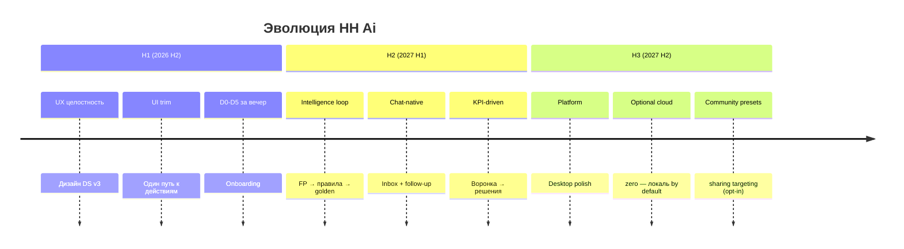

# Стратегия продукта HH Ai (2026–2027)

**Версия:** 1.0 · **2026-06-03**  
**Операционный план:** [DEVELOPMENT-PLAN-2026-06-PHASE2.md](DEVELOPMENT-PLAN-2026-06-PHASE2.md) v2.0  
**Дизайн-экосистема:** [DESIGN-ECOSYSTEM-INDEX.md](DESIGN-ECOSYSTEM-INDEX.md)

---

## 1. Миссия и позиционирование

**HH Ai** — локальный CRM для активного поиска работы на hh.ru: сбор → оценка → письмо → отклик → переписка → аналитика. Не «бот ради бота», а **контролируемая автоматизация** с прозрачными лимитами и качеством.

| | HH Ai | Ручной hh.ru | «Чёрные» автокликеры |
|---|-------|--------------|----------------------|
| Контроль письма | черновик, score, golden | полный | нет |
| Таргетинг | правила + FP guard | в голове | слабый |
| Прозрачность | precheck, отчёт, воронка | — | нет |
| Риск блокировки | rate-limit, human-delay | низкий | высокий |
| Установка | desktop / zip / git | — | varies |

**Уникальное обещание:** «Видишь, *почему* вакансия отсеялась и *как* выглядит письмо, до нажатия отклика».

---

## 2. Три горизонта

| Горизонт | Квартал | North Star |
|----------|---------|------------|
| **H1** | Q3–Q4 2026 | Первый батч без README за ≤45 мин |
| **H2** | Q1 2027 | ≥60% откликов без правки письма; invite rate растёт |
| **H3** | Q2 2027 | Desktop = default install; friction log ≤1 критичная/релиз |

---

## 3. Столпы продукта (pillars)

| # | Столп | Что значит для пользователя | Документы |
|---|-------|----------------------------|-----------|
| **P1** | **Доверие** | UI не ломается, ошибки понятны, секреты локально | QA scorecard, api-errors |
| **P2** | **Качество отклика** | Письмо и таргетинг проверены до send | COVER-LETTER-PLAN |
| **P3** | **Скорость цикла** | Harvest → batch → sync за один «утренний цикл» | BATCH, daily-routine |
| **P4** | **Обратная связь** | Воронка, FP, digest — видно, что улучшать | DESIGN-PLAN, funnel |
| **P5** | **Доступность** | Simple mode, plain RU, desktop без терминала | USER-UX, TAURI |

Каждая фича должна усиливать **≥1 столп**. Иначе — backlog или reject.

---

## 4. Карта возможностей (capability map)

| Capability | Зрелость | Следующий шаг | Track |
|------------|----------|---------------|-------|
| Очередь + карточки | ●●●○ | skeleton, score badge | 2 |
| Настройки 5 вкладок | ●●●● | live preview, search | 1, 4 |
| Батч + precheck | ●●●● | prefs diff history | 1 |
| Letter quality hub | ●●●○ | 7d trend, scale legend | 1, 5 |
| Telegram notify | ●●○○ | templates, inline buttons | 3 |
| Chat inbox | ●●●○ | badge polish, WS backlog | 7 |
| Desktop Tauri | ●●●○ | bundled chromium, auto-update | 8 |
| Portable zip | ●●○○ | demo queue | 6 |
| Targeting learning | ●●●○ | 1-click golden from reject | 2 |
| Analytics funnel | ●●○○ | weekly cohort, CSV | 5 |

● = зрелость из 4

---

## 5. Персоны (расширено)

### 5.1 Охотник (power user)

- **20–40 откликов/день**, expert mode, знает golden set  
- **Нужно:** скорость, фильтры, letter batch, KPI  
- **Боль:** дубли UI (решено trim), hub без тренда  
- **Roadmap:** P1 hub trend → P2 letter filter → P4 screenshot CI

### 5.2 Аккуратный (quality-first)

- **5–10 откликов/день**, правит каждое письмо  
- **Нужно:** score на карточке, precheck diff, понятный FP  
- **Боль:** неясно, что изменить в таргетинге после FP  
- **Roadmap:** S-07 preview → L-03 golden button → glossary

### 5.3 Новичок

- **Первый запуск**, simple mode  
- **Нужно:** onboarding, один путь «Действия», setup wizard  
- **Боль:** Node, login, пустая очередь  
- **Roadmap:** R-04 demo → R-02 setup → DS-23 first-run card

### 5.4 Переговорщик (chat-heavy)

- **Много invite/decline в чатах**  
- **Нужно:** inbox, follow-up, nudge  
- **Боль:** polling, нет связи чат ↔ карточка в simple  
- **Roadmap:** Track 7 — inbox badge в workflow «Следить»

### 5.5 Мейнтейнер / форк

- **CI, docs, не сломать UI**  
- **Нужно:** check:dashboard, STYLE_VERSION, CONTRIBUTING  
- **Roadmap:** DS-07 screenshots, pre-commit, MAINTAINER checklist

---

## 6. Путь пользователя D0–D30

| День | Этап | Ключевые экраны | Метрика успеха |
|------|------|-----------------|----------------|
| D0 | Install | FIRST-RUN, setup | dashboard открыт ≤15 мин |
| D1 | Login + harvest | actions, job progress | очередь ≥10 |
| D2 | Review | cards, workflow 2 | ≥5 approved |
| D3 | First batch | precheck, report | done ≥1 |
| D4 | Tune | settings targeting | FP rate снижается |
| D7 | Routine | daily cycle, digest | sync без ошибок |
| D14 | Chat | inbox, follow-up | ≥1 reply sent |
| D30 | Optimize | funnel, hub, KPI | invite rate baseline |

---

## 7. Конкурентные ставки (куда инвестировать)

| Ставка | Обоснование | Не делать |
|--------|-------------|-----------|
| **Локальность** | доверие, GDPR-like без облака | SaaS multi-tenant |
| **Letter QA loop** | diff vs конкуренты | generic GPT wrapper |
| **Unified UX** | один язык, один путь | feature flags хаос |
| **Desktop first (RU)** | hh.ru + Windows аудитория | mobile app native |
| **Telegram as mirror** | уведомления, не второй UI | full bot CRM |

---

## 8. Release train (2026 H2)

| Релиз | Ориентир | Содержание | Gate |
|-------|----------|------------|------|
| **3.0.6** | июн 2026 | P0 trim stabilize | quality:dashboard |
| **3.1.0** | июл 2026 | P1 workflow + preview | friction self-test |
| **3.2.0** | авг 2026 | P2 cards + letters | test:dashboard-ui |
| **3.3.0** | сен 2026 | P3 portable + setup | qa:clean-install |
| **3.4.0** | окт 2026 | P4 quality CI + a11y | verify:local |
| **3.5.0** | Q4 2026 | Track 7 chat polish | inbox E2E |

---

## 9. Риски стратегии

| Риск | Вероятность | Импакт | Митигация |
|------|-------------|--------|-----------|
| hh.ru ломает селекторы | высокая | высокий | codegen-hh, nightly smoke |
| LLM cost / quota | средняя | средний | brief cache, batch limits |
| UX regression без screenshot CI | средняя | средний | DS-07 в P4 |
| Over-automation ban | низкая | критический | rate-limit docs, defaults conservative |
| Maintainer burnout | средняя | высокий | small PRs, release train |

---

## 10. Связь документов

| Уровень | Документ | Вопрос |
|---------|----------|--------|
| Стратегия | **этот файл** | Зачем и куда? |
| План фаз | DEVELOPMENT-PLAN-PHASE2 v2 | Что когда? |
| Дизайн scope | DESIGN-SYSTEM-PLAN v3 | Как выглядит? |
| Backlog ID | DEVELOPMENT-IDEAS | Что в очереди? |
| Letter depth | COVER-LETTER-PLAN | Как качество? |
| Chat depth | CHAT-INBOX-PLAN | Как переписка? |
| Desktop | TAURI-PLAN | Как installer? |
| UX язык | USER-UX-PLAN | Как говорим? |

---

## История

| Версия | Дата | Изменение |
|--------|------|-----------|
| 1.0 | 2026-06-03 | Стратегия H1–H3, персоны, capability map, release train |
