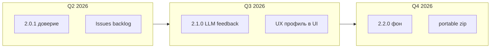

# Roadmap HH Ai (подробный)

**Версия:** 2.0.0 · **Репозиторий:** [emildg8/HH_Ai](https://github.com/emildg8/HH_Ai) · идея-основа: [Steev193/hh-ru-apply](https://github.com/Steev193/hh-ru-apply)

Исходная цель: меньше ручного труда на hh.ru при контроле качества откликов, с ростом качества LLM и учётом приглашений/отказов.

Статусы: `[x]` сделано · `[~]` в работе · `[ ]` запланировано

---

## Фаза 0 — Фундамент (1.0.0–1.0.1)

| ID | Задача | Статус |
|----|--------|--------|
| 0.1 | Очередь, harvest, LLM-скоринг, дашборд | [x] |
| 0.2 | DevOps-профиль, batch, reject-similar | [x] |
| 0.3 | Анкета работодателя, probe, LLM-ответы | [x] |
| 0.4 | Тема светлая/тёмная, масштаб UI | [x] |
| 0.5 | VERSION, CHANGELOG, SECURITY, бэкапы, export:public | [x] |
| 0.6 | Профили HH_PROFILE | [x] |
| 0.7 | UI: масштаб 85% без пустых полей, модалки вне zoom | [x] 1.0.1 |
| 0.8 | verify-local, плотность карточек compact/medium/full | [x] 1.0.1 |

---

## Фаза 0.9 — Релиз 2.0 (батч, анкеты, распространение)

| ID | Задача | Статус |
|----|--------|--------|
| 0.9.1 | Батч: анкета без отправки, код выхода 5, области batch-scope | [x] 2.0 |
| 0.9.2 | Журнал батча: понятные причины пропуска | [x] 2.0 |
| 0.9.3 | Harvest: hint анкеты, фильтры заголовка, exclude tokens | [x] 2.0 |
| 0.9.4 | Капча: ожидание в Chromium | [x] 2.0 |
| 0.9.5 | `release:public`, PUBLIC-RELEASE.md | [x] 2.0 |
| 0.9.6 | OpenRouter fallback, улучшение писем/резюме в форме | [x] 2.0 |

---

## Фаза 1 — Распространение без Docker (без SaaS)

> Docker остаётся опциональным. **SaaS не планируем** в этой фазе.

| ID | Задача | Результат | Статус |
|----|--------|-----------|--------|
| R1.1 | `scripts/install.ps1` / `install.sh` | Установка Node deps + Playwright + .env | [x] |
| R1.2 | **Portable ZIP** из CI | `hh-ru-apply-win-x64-vX.zip` на GitHub Releases | [ ] |
| R1.3 | `install-portable.ps1` внутри zip | Распаковал → install → ярлык дашборда | [~] |
| R1.4 | **Release assets** | Тег `v*` → CI [release.yml](../.github/workflows/release.yml) + zip | [~] |
| R1.5 | Страница «Скачать» в README | Таблица: zip, git clone, требования | [x] |
| R1.6 | `npm run setup` интерактив | Профиль, пресет LLM (`scripts/setup-wizard.mjs`) | [x] |
| R1.7 | Проверка на чистой VM Win10/11 | Чеклист [QA-CLEAN-INSTALL.md](QA-CLEAN-INSTALL.md) | [~] |

### Критерии готовности R1

- Новый пользователь без Docker ставит за ≤30 мин по README.
- Скачивание с Releases: zip + `EXPORT-README.md`.
- Версия в zip = `VERSION` + тег git.

---

## Фаза 2 — Качество LLM и обратная связь

| ID | Задача | Детали | Статус |
|----|--------|--------|--------|
| R2.1 | Тег `invited` в дашборде | Кнопка «Пригласили» → в эталоны писем | [ ] |
| R2.2 | Экспорт invited/declined в `feedback.jsonl` | Контекст для следующего generate | [ ] |
| R2.3 | Few-shot по типу вакансии | SRE / DBA / platform — теги из `geminiTags` | [ ] |
| R2.4 | Анкета: авто-reprobe при generic labels | Дашборд + уведомление | [ ] |
| R2.5 | A/B 2 варианта письма | Выбор в UI до утверждения | [ ] |
| R2.6 | Метрики в карточке | % правок письма, дата отклика | [ ] |

---

## Фаза 3 — Автоматизация и фон

| ID | Задача | Детали | Статус |
|----|--------|--------|--------|
| R3.1 | Фоновые задачи (бэкап, verify) | Локальный планировщик ОС, вне git | [ ] |
| R3.2 | `verify-local` + `smoke:release` в CI | [.github/workflows/ci.yml](../.github/workflows/ci.yml) | [x] |
| R3.3 | Telegram: «harvest готов N≥50» | Bot token в .env | [ ] |
| R3.4 | Умный batch: стоп при капче | Детект + пауза (2.0: wait в Chromium) | [~] |
| R3.5 | Очередь «отложить до завтра» | Поле `deferUntil` | [ ] |
| R3.6 | Ночной rescore только pending | `npm run rescore-queue` | [ ] |
| R3.7 | Pre-push hook секретов | `npm run secrets:check` + `hooks:install` | [x] |

---

## Фаза 4 — UX дашборда

| ID | Задача | Статус |
|----|--------|--------|
| R4.1 | Выбор профиля HH_PROFILE в UI | [ ] |
| R4.2 | Массовый probe анкет по фильтру | [ ] |
| R4.3 | Статистика откликов/день | [ ] |
| R4.4 | Экспорт карточки в markdown | [ ] |
| R4.5 | Горячие клавиши (approve/reject) | [ ] |

---

## Фаза 5 — Опыт собеседований (после снижения ежедневной нагрузки)

| ID | Задача | Статус |
|----|--------|--------|
| R5.1 | База вопросов с собесов | [ ] |
| R5.2 | Подсказки в анкете из базы | [ ] |
| R5.3 | Связь компания → история отказов/invite | [ ] |

---

## Фаза 6 — Desktop (опционально, после R1)

| ID | Задача | Статус |
|----|--------|--------|
| R6.1 | Tauri-оболочка над дашбордом | [ ] |
| R6.2 | Встроенный «Установить Chromium» | [ ] |

**Не в scope:** SaaS с хранением cookies на сервере; обход капчи/ToS hh.ru.

---

## Метрики

| Метрика | Сейчас | Цель Q3 2026 |
|---------|--------|----------------|
| Отклики без правки письма | — | ≥60% |
| verify-local ok | CI на push/PR | ежедневно + перед тегом |
| Время harvest→отклик | — | <5 мин/вакансия |
| Утечки секретов в git | 0 | 0 |

---

## План 2026 H2 (после 2.0.0)

**Горизонт:** май–декабрь 2026 · **Цель:** доверие новых пользователей (R1) → качество писем (R2) → фон и UX (R3–R4).



### Версии (кратко)

| Версия | Фокус | Статус |
|--------|--------|--------|
| **2.0.1** | CI, QA, release workflow, setup, backlog Issues | [~] в основном сделано |
| **2.1.0** | Feedback invited/declined, HH_PROFILE в UI, резюме в батче | [ ] |
| **2.2.0** | deferUntil, Telegram, метрики, portable zip | [ ] |
| **3.0.0** | *(опционально)* Tauri / portable-only | [ ] backlog |

---

### 2.0.1 — «Можно отдавать и не стыдно» (Q2 2026)

Закрывает хвост **фазы 1** и стабильность для мейнтейнера.

| # | Задача | Roadmap | Статус | Ссылка |
|---|--------|---------|--------|--------|
| 1 | CI: `verify:local` + `smoke:release` + UI smoke | R3.2 | [x] | [ci.yml](../.github/workflows/ci.yml) |
| 2 | Release при теге `v*` → zip на GitHub | R1.4 | [~] | [release.yml](../.github/workflows/release.yml) — проверить на `v2.0.1` |
| 3 | [QA-CLEAN-INSTALL.md](QA-CLEAN-INSTALL.md) | R1.7 | [~] | прогон на чистой VM |
| 4 | [MAINTAINER.md](MAINTAINER.md), [UX-FRICTION-LOG.md](UX-FRICTION-LOG.md) | — | [x] | |
| 5 | `npm run setup`, `secrets:check`, `hooks:install` | R1.6, R3.7 | [x] | |
| 6 | GitHub Issues backlog | — | [x] | [BACKLOG.md](issues/BACKLOG.md) |
| 7 | README «Скачать» (zip / clone) | R1.5 | [x] | |

**Критерий выхода 2.0.1:** тег `v2.0.1` + CI green + один прогон QA ≤30 мин + zip на [Releases](https://github.com/emildg8/HH_Ai/releases).

**Команды перед тегом:**

```bash
npm run smoke:release
npm run verify:local
git tag v2.0.1 && git push hh_ai v2.0.1
```

---

### 2.1.0 — «Меньше ручной возни» (Q3 2026)

Приоритет: качество писем и ежедневный DevOps-поиск.

| # | Задача | Roadmap | Issue |
|---|--------|---------|-------|
| 1 | Кнопки «Пригласили» / «Отказ» → `feedback.jsonl` | R2.1–R2.2 | [#5](https://github.com/emildg8/HH_Ai/issues/5) |
| 2 | Few-shot по `geminiTags` (SRE / platform / …) | R2.3 | — |
| 3 | Выбор `HH_PROFILE` в дашборде | R4.1 | — |
| 4 | Батч: стабильный выбор резюме DevOps (hash + лог) | техдолг | [#3](https://github.com/emildg8/HH_Ai/issues/3) |
| 5 | `npm run apply` без «browser closed» | — | [#4](https://github.com/emildg8/HH_Ai/issues/4) |
| 6 | Метрики карточки: % правок, дата отклика | R2.6, R4.3 | — |
| 7 | A/B два варианта письма до утверждения | R2.5 | — |

**Критерий выхода 2.1.0:** ≥50% писем утверждаются без правки (см. метрики ниже); закрыты #3 и #4 или задокументирован workaround.

---

### 2.2.0 — «Умный фон» (Q4 2026)

| # | Задача | Roadmap |
|---|--------|---------|
| 1 | `deferUntil` — отложить вакансию | R3.5 |
| 2 | Ночной `rescore` только pending | R3.6 |
| 3 | Telegram после harvest (N≥50) | R3.3 |
| 4 | Батч: явная пауза при капче + resume | R3.4 |
| 5 | Массовый probe анкет по фильтру | R4.2 |
| 6 | Portable win-x64 zip в CI | R1.2 |
| 7 | `install-portable.ps1` в архиве | R1.3 |

---

### Техдолг и селекторы (постоянно)

| Тема | Действие | Issue |
|------|----------|-------|
| Вёрстка hh.ru изменилась | `npm run codegen-hh` → `lib/hh-*-selectors.mjs` | [#6](https://github.com/emildg8/HH_Ai/issues/6) |
| Friction внешнего тестера | Запись в [UX-FRICTION-LOG.md](UX-FRICTION-LOG.md) → Issue «Онбординг» | шаблон в `.github/ISSUE_TEMPLATE/` |

**Не в scope H2:** SaaS с cookies на сервере; обход капчи/ToS hh.ru.

---

### Спринт «следующая сессия» (рекомендуемый порядок)

1. Прогон [QA-CLEAN-INSTALL.md](QA-CLEAN-INSTALL.md) на VM → friction в журнал.
2. Тег **v2.0.1** (проверка `release.yml`).
3. Закрыть [#3](https://github.com/emildg8/HH_Ai/issues/3) (резюме в батче).
4. Старт **2.1.0**: [#5](https://github.com/emildg8/HH_Ai/issues/5) (invited/declined).

---

## Версионирование

| Версия | Содержание |
|--------|------------|
| 1.0.0 | DevOps-профиль, дашборд, batch |
| 1.0.1 | UI scale/modals, verify, плотность карточек |
| 2.0.0 | Батч+анкета, публичный релиз, CONFIG-GUIDE, пресеты |
| 2.0.1 | Maintainer/QA, CI, `npm run setup`, secrets hook |
| 2.1.0 | Feedback invited (R2) |
| 2.2.0 | Фон, defer, portable zip (R1.2) |

Команды: `npm run release:public` · `npm run smoke:release` · `npm run setup` · `npm run backup` · `npm run export:public`

Для мейнтейнера: [MAINTAINER.md](MAINTAINER.md)
