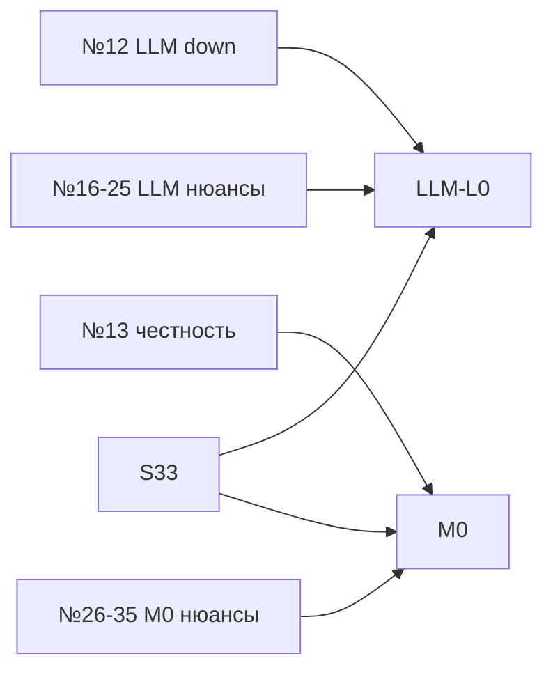

# SCENARIOS-PLAYBOOK — реестр ситуаций и нюансов

> **Канон «что делать, если…»** — этот файл.  
> В [`MASTER-ROADMAP.md`](MASTER-ROADMAP.md) — только индекс по категориям и P0-сценарии.  
> LLM-ветки → [`LLM-ROADMAP.md`](LLM-ROADMAP.md) · M0 → [`MULTIMODAL-ROADMAP.md`](MULTIMODAL-ROADMAP.md)

**Обновлено:** 19.07.2026 · **финализация:** №12–**86** (hybridMoscowOnly / региональный гибрид)

---

## Как пользоваться

| Колонка | Смысл |
|---------|--------|
| **№** | Стабильный ID (не менять — ссылаются LEARNING-LOG и MASTER) |
| **P** | P0 блокер · P1 важно · P2 редко · P3 косметика |
| **Столп** | H охота · I собес · P продукт · X поперечно |
| **Срез** | Когда закрывать в коде/процессе |

**Правило:** повтор ситуации 2+ раза → строка в [`LEARNING-LOG.md`](LEARNING-LOG.md); системный баг → тест в `scripts/test-*.mjs`.

---

## Индекс по категориям

| Категория | № | Канон деталей |
|-----------|-----|---------------|
| Воронка / hh.ru | 1–11, 46–50, **61–74, 83–86** | § Охота · HH-INGEST-ROADMAP |
| LLM / провайдеры | 12, 16–25 | § LLM · LLM-ROADMAP |
| Честность / M0 | 13, 26–35 | § M0 · MULTIMODAL-ROADMAP |
| Собес / голос | 14, 14b, 36–45 | § Собес |
| UI / инфра / bandicam | 51–55, **75–80** | § Продукт и ops |
| Безопасность / данные | 56–60 | § Безопасность |

---

## Охота и отклик (H)

| № | P | Ситуация | Признаки | Действие | Запасной вариант |
|---|-----|----------|----------|----------|------------------|
| **1** | P1 | Sync → 0 invited, слот не виден | Пусто «Приглашения» | Учебный прогон в Hub | demo-запись |
| **46** | P0 | Mass apply при precheck < порога | «Можно ли запускать» красное | Не стартовать; S1 письма/gate | Перенос на четверг |
| **47** | P0 | Письма 6/25, regen сбросил approved | approvedText пуст | `--approve-only` после regen | tier A вручную |
| **48** | P1 | Precheck CLI ≠ дашборд | Разный счёт готовых | `s1-hunt-preflight` как UI | LEARNING-LOG S1 |
| **49** | P1 | Harvest во время правки настроек | Чёрный центр списка | Ctrl+F5; не save prefs при harvest | try/catch (волна D) |
| **50** | P1 | Капча / анкета 6+ вопросов | apply-log стоп | Skip; не считать провалом продукта | questionnaire-prep |
| **15** | P0 | L4 partial, таймаут wall | skills fail, 240s | Не успех; restore резюме | отклик без L4 |
| **51** | P1 | Повторный отклик на vacancyId | «уже откликались» | Честный skip, без ложного toast | test:apply-log-golden |
| **52** | P2 | Очередь stale — топ по score не tier A | Неверный precheck | Обновить harvest; фильтр tier A | prefs threshold |
| **53** | P1 | Батч + ручной apply на той же вакансии | Race браузера | Дождаться паузы батча | browser.lock |
| **54** | P2 | Employer enrich 31+ за день | Tier3 skip в логе | Отклик не блокируется | B1C лимиты |
| **55** | P2 | «Уже на hh» vs наш queued | chip already-applied | probe API; не regen письмо зря | apply-gate |
| **61** | P1 | HH API 429 / rate limit | harvest stall, quota red | Backoff; `HH_API_ON_429=playwright`; pause | HI.1a · [HH-INGEST](HH-INGEST-ROADMAP.md) |
| **62** | P1 | API description короче Playwright | Слабый score/письмо | Fallback PW для id; lazy detail | HI.0 |
| **63** | P2 | Дневной budget API исчерпан | Pill degraded в UI | Playwright до полночи UTC; снизить detail | HI.1a |
| **64** | P2 | Search API ≠ web SERP | Пропуск tier A | Сравнить overlap в probe; PW для ключа | HI.0 |
| **65** | P2 | User-Agent не задан / блок | 403 на api.hh.ru | `HH_API_USER_AGENT`; setup:check | CONFIG-GUIDE |
| **66** | P0 | Отклик без письма (exit 7) | `letter_not_delivered` в логе; failed в серии | Не считать ok; проверить apply-gate post-check | regen + ручной отклик; [`HUNT-ARCHITECTURE.md`](HUNT-ARCHITECTURE.md) |
| **67** | P1 | Recap в `approvedText` | Precheck режет ready; «ваша вакансия … требует» | Regen с M0 pack; `--approve-only` | `letter-quality.mjs` · tier A вручную |
| **68** | P1 | Перепутали профиль / чужая сессия hh | Отклик ушёл не в тот контур, в шапке другой бейдж | Проверить порт и бейдж инстанса; выйти из чужой hh-сессии и перелогиниться в нужный профиль | Перезапуск по нужному `dashboard:*` и `login:*`; см. [`MULTI-PROFILE-GUIDE.md`](MULTI-PROFILE-GUIDE.md) |
| **69** | P1 | Point apply — не тот huntTrack / резюме | Отклик с чужим hash или framing | `resume-routing` + `--track=`; не batch | [`H-PROFILE-ROADMAP.md`](H-PROFILE-ROADMAP.md) HT.7 |
| **70** | P1 | CV обновлён (HT.6), письма старые | L2-framing в approvedText | HT.6.7 regen tier A; не point apply до regen | `devops:regenerate-letters` |
| **71** | P1 | Роль в письме ≠ заголовок вакансии | MLOps vs DevOps и т.п. | `letter-vacancy-coherence`; `alignLetterClaimedRoleWithVacancy` | test:letter-vacancy-coherence |
| **72** | P1 | tam — auto без approval | `apply-point-ready --track=tam` без `userApproved` | approval на карточке (`userApproved`); **l2l3** — auto (HT.7.4) | [`H-PROFILE-ROADMAP.md`](H-PROFILE-ROADMAP.md) HT.7.3/7.4 · `hunt-tracks.json` |
| **73** | P1 | Анкета работодателя на lead-JD (3+ поля) | Мастер отклика ≠ только письмо; чат без ответов анкеты | Probe → `savedAnswers` → `--questionnaire-auto`; предупредить партнёра **до** apply | `anastasia-apply-qa.mdc` · [`SESSION-2026-07-03-ibs-apply-lessons.md`](SESSION-2026-07-03-ibs-apply-lessons.md) |
| **74** | P1 | Probe «архив», на hh «Вы откликнулись» | `hhSiteState: archived` при HTTP 200 | Не писать «в архиве»; `already_applied` / `responded` | `anastasia-apply-qa.mdc` · apply-truth |
| **83** | P1 | Два чата Cursor + live apply одновременно | `browser.lock` на инстансе; половинчатые фиксы `hh-chat-selectors`; голые отклики; repair то GO то FAIL | **Стоп** второй lane; дождаться ship; `clearStaleBrowserLock` **своего** `data-{instance}`; repair по одной вакансии; правки `lib/` — **после** волны | [`SESSION-2026-07-13-parallel-apply-postmortem.md`](SESSION-2026-07-13-parallel-apply-postmortem.md) · skill `hh-ru-apply-workflow` § apply-lane |
| **84** | P0 | Иссяк DevOps → гнать L2 «по open» без корзины | score 59–65; «с нуля»/SS7; тест-письмо; отказ за минуты; `_tmp` pack | **Стоп**; anti-pattern doc; draft→ME→build как для devops; soft hybrid — отдельно | [`SESSION-2026-07-15-wave-l2-anti-pattern.md`](SESSION-2026-07-15-wave-l2-anti-pattern.md) |
| **85** | P0 | Чужое резюме + дубль-чат на одну вакансию | Форма: только lead/L2; `fallback-single` ok; quiz без сверки title; повтор ship / «другим резюме» без снятия старого → 2 отклика (Альтуэра×2, Ригла×2) | **Стоп** submit (`wrong_resume`); pack-ship SKIP already_applied; руками один тред; infra hash = live | [`SESSION-2026-07-16-duplicate-apply-postmortem.md`](SESSION-2026-07-16-duplicate-apply-postmortem.md) · hh-resume-picker · №69 |
| **88** | P2 | Отказ на hh — что делать | Шаблонный отказ → паника / перепись всех писем; или игнор hard-req (K8s) | Маршрут: sync → класс A–H → одно действие; шаблон≠плохое письмо | [`DECLINE-REVIEW-ROUTE.md`](DECLINE-REVIEW-ROUTE.md) |
| **86** | P0 | Гибрид вне Москвы ушёл в auto-ship | `hasRemote`+`hasHybrid`+город офиса ≠ МСК → было `coreRemote` / pass; hh warning про город резюме | Gate: «Гибрид не в Москве»; не путать с чистой удалёнкой (HQ в регионе); override `userApproved` | [`SESSION-2026-07-19-hybrid-moscow-gate.md`](SESSION-2026-07-19-hybrid-moscow-gate.md) · work-format-inference · №hybridMoscowOnly |
| **86** | P1 | Шторм / шум HR→Telegram после sync | Много старых `needs_reply` или ложные auto_reply | `HH_CHAT_UNREAD_TELEGRAM=0` (мгновенный откат) · `npm run devops:seed-chat-unread-tg` · sync с `--skip-unread-tg` · удалить `{DATA}/telegram-chat-unread-push-state.json` + seed | [`TG-CAPTCHA-HR-PUSH.md`](TG-CAPTCHA-HR-PUSH.md) · `lib/chat-unread-notify.mjs` |
| **87** | P1 | Капча TG: шум фото / ложный ввод кода | Cooldown; SmartCaptcha без поля | `HH_CAPTCHA_TELEGRAM_PHOTO=0` · `HH_CAPTCHA_TELEGRAM_SOLVE=0` · `/captcha_cancel` · код только `/captcha` или reply на фото · `HH_HARVEST_TELEGRAM=0` | [`TG-CAPTCHA-HR-PUSH.md`](TG-CAPTCHA-HR-PUSH.md) · `hh-captcha-telegram-solve` |
| **89** | P0 | Ворота охоты «разъехались» после правки assess/fresh | L1 в go; или L2 с helpdesk снова no-go; crypto-lead в go; probe-мёртвые >40% на выборке | Класс сбоя → фикс: L1=`titleLooksL1HelpdeskRole`; не возвращать голый helpdesk; crypto усилить в **policy**; fresh → `HH_FRESH_TIER_A_MAX_HOURS=72`; после 2 неудачных точечных фиксов — `git revert` среза | [`HUNT-DAY-ORCHESTRATOR.md`](HUNT-DAY-ORCHESTRATOR.md) § откат ворот · `test:hunt-day-assess` · `test-role-reject-learn` |
| **92** | P1 | Night harvest: прогресс в `data/`, статус Emil «старый» | `harvest-status` смотрит `data-emil`, silent без instance писал в `data/`; очередь Emil при этом в `data/vacancies-devops.json` | Не путать прогресс и очередь; silent только через `run-with-instance`; не слать ночной junk (+1354) | [`SESSION-2026-07-29-data-vs-data-emil.md`](SESSION-2026-07-29-data-vs-data-emil.md) · `run-harvest-watchdog-bg` |
| **90** | P0 | `vacancies-devops.json` обрезан / JSON mid-write | Parse fail; файл ~0.5MB вместо ~8–20MB; Cursor kill / EPERM | Не `writeFileSync` live; `loadQueue` → `.bak` / `queue-snapshots`; `npm run devops:restore-vacancies-queue -- --write`; хвост harvest — `HH_HARVEST_REUSE_URLS=1` + watchdog | `queue-atomic-write` · `test:queue-atomic-write` · LEARNING-LOG H/queue-corrupt |
| **91** | P1 | Cursor окно `reason:oom` при свободной RAM | Диалог OOM; система 50%+ free; harvest пишет 15MB JSON часто | Не открывать `vacancies-devops.json` в редакторе; `.cursorignore` + watcherExclude; harvest без snapshot / `SAVE_EVERY=10`; New Window | LEARNING-LOG P/cursor-oom · SCENARIOS №90 |

---

## LLM и провайдеры (X / H)

| № | P | Ситуация | Признаки | Действие | Срез |
|---|-----|----------|----------|----------|------|
| **12** | P0 | Баланс DS Lab / 503 / OR 429 | Toast DS Lab→OR или ошибка письма | [LLM-ROADMAP §12](LLM-ROADMAP.md); ops-log | L0.1 |
| **16** | P1 | Ollama не запущен, в env указан | `ECONNREFUSED :11434` | `ollama serve` или пресет dslab-only | L0.1 |
| **17** | P1 | Конфликт `.env` vs `secrets.local.env` | setup:check странный | Канон: secrets.local > .env | CONFIG-GUIDE |
| **18** | P1 | Модель переименована в каталоге DS Lab | LLM 404 model | Обновить `HH_CUSTOM_LLM_MODEL` | L0.1 |
| **19** | P1 | Невалидный JSON от LLM (письма) | retry в логе | Уже retry; снизить temperature | L0.2 router |
| **20** | P2 | Промпт > context window | обрезка / 400 | Укоротить CV chunk; brief 2-phase | L0.4 |
| **21** | P1 | Harvest + письма параллельно жрут баланс | Быстрый ноль коинов | `HH_LLM_MAX_PER_RUN`; pause harvest | L0.4 |
| **22** | P2 | Fallback OR хуже по RU | Письмо слабее на OR | `FALLBACK_OPENROUTER=0`; Ollama | L0.3 A/B |
| **23** | P1 | Перезапуск дашборда — «забыли» active LLM | Панель unknown до 1-го вызова | Читать `llm-provider-events.jsonl` | L0.5 |
| **24** | P2 | Ключ OR утёк в чат | — | Ротация в кабинете OR; secrets | ops |
| **25** | P3 | HR-бот hh детектит «нейросеть» | отказ/шаблон | Ручная правка; antiAiRules; M0 факты | M0.2 |
| **21b** | P1 | Tier B письмо ушло в DS Lab premium | Слив бюджета | `HH_LLM_POLICY_LETTER` tier A only | L0.7 |

---

## M0 — честность и контекст (X / H / I)

| № | P | Ситуация | Признаки | Действие | Срез |
|---|-----|----------|----------|----------|------|
| **13** | P0 | Выдуманный факт в письме | Нет в CV/inventory | `letterSafe` E2+; golden letters | M0.2 |
| **26** | P1 | Inventory пуст — pack = только CV | Слабые письма при «хорошем» LLM | M0.1 workshop | M0.1 |
| **27** | P1 | skill E0 без артефакта в письме | Агент «галлюцинировал» | Понизить tier; antiPatterns | M0.1 |
| **28** | P1 | Gate advisory выше CV score | Путаница tier | UI: два балла; авто только CV | M0.2 |
| **29** | P2 | CV на hh обновлён вручную | Drift с snapshot | restore baseline; новый snapshot | B1B |
| **30** | P2 | employer RAG противоречит inventory | Странный тон письма | RAG > generic; не выдумывать | — |
| **31** | P1 | market-skills «надо K8s», в inventory нет | Панель давит | diff в UI; не в L4 без E2 | M0.4 |
| **32** | P2 | Видео-доказательство переехало | Битая ссылка в index | Обновить multimodalRefs | M0.1 |
| **33** | P1 | A/B LLM без pack | Ложный вывод о модели | A/B pack on/off обязателен | L0.3 |
| **34** | P2 | Два агента правят inventory | merge conflict JSON | changelog; один редактор | M0.1 |
| **35** | P3 | Переоценка pet как commercial prod | HR ловит на собесе | antiPatterns; мост L2→DevOps | M0 |

---

## Собес, суфлёр, голос (I)

| № | P | Ситуация | Признаки | Действие | Срез |
|---|-----|----------|----------|----------|------|
| **14** | P0 | STT пустой / суфлёр молчит | Нет текста в live | ffmpeg, mic, Desktop; copilot-devices | V0 |
| **14b** | P1 | Репетиция: Whisper долго / есть готовый транскрипт | Zoom/TAM выдал `.srt`; «Подготовить» крутит минуты | Sidecar `interview_transcript.srt` или `{имя_видео}.srt`/`.txt` **рядом с mp4** в `HH_INTERVIEW_DIR` → снова «Подготовить» (Whisper пропускается) | DEMO-COPILOT · V0 |
| **36** | P1 | Latency STT > 3 с | Ответ с опозданием | `HH_STT_MODE=fast`; smaller model | V0 |
| **37** | P2 | Whisper ошибся (EN/RU mix) | Бессмыслица в transcript | Ручная правка; refine local LLM | — |
| **38** | P1 | GPU throttling 8GB | Ollama+Whisper вместе тормозят | Не гонять LLM во время live | V0 |
| **39** | P1 | Zoom без Desktop overlay | Суфлёр не виден | teleprompter.html / Desktop | DEMO-COPILOT |
| **40** | P2 | voiceProfile пуст после debrief | Однообразные ответы | post-debrief → M0.5 | M0.3 |
| **41** | P2 | Copilot LLM timeout на live | Пустой ответ | quickAnswer tier1 fallback | L0.3 |
| **42** | P1 | Приглашение E — нет prep | Пустой hub | auto-prep; учебный прогон | A done |
| **43** | P2 | Оффер F без слота в queue | Нет vacancyId | sync откликов | волна E |
| **44** | P3 | Шум в комнате / loopback | Мусор в STT | WASAPI; mute loopback test | copilot-capture |
| **45** | P2 | Запись собеса без согласия | Юридический риск | Только local; не cloud STT | §56 |

---

## Продукт, ops, инфра (P / X)

| № | P | Ситуация | Признаки | Действие |
|---|-----|----------|----------|----------|
| **56** | P1 | Персональные данные в облачный LLM | CV в промпте | tier A only; redact; local STT |
| **57** | P2 | `data/` переполнен / диск | whisper fail | Чистить copilot-stt-tmp, старые логи |
| **58** | P1 | Дашборд :3849 занят | EADDRINUSE | Kill по PID порта, не весь Chrome |
| **59** | P2 | Старый `app.js` без Ctrl+F5 | Нет toast LLM | Ctrl+F5; проверить `?v=` |
| **60** | P2 | Telegram бот молчит при LLM switch | Нет notify в TG | Backlog: webhook из llm-provider-events |
| **75** | P1 | Bandicam/OBS: мигание Desktop + harvest | Чёрные кадры: Playwright Chrome в scoring; `about:blank` от resume-raise (retry каждую минуту); WebView2 при движении мыши | Fix bundle 03.07 — [`SESSION-2026-07-03-copilot-synthetic-v3-bandicam-me.md`](SESSION-2026-07-03-copilot-synthetic-v3-bandicam-me.md) §Fix bundle; **перед записью:** harvest **Пауза**, desktop3 rebuild, **30 с** mouse test без чёрных кадров | [`DEMO-COPILOT-LB-V4.md`](DEMO-COPILOT-LB-V4.md) §Перед bandicam |
| **76** | P1 | Synthetic train D3: clips 25/39, flash OK | Rolling STT без await; global clip match; q-stale на wav-feed; gap 0s | `await resetFastSttRollingPrompt()` · `wavFeedClip: true` · gap **3s** · time-window в session-report · `npm run devops:synthetic-interview-me-verify` | [`SESSION-2026-07-04-synthetic-train-close.md`](SESSION-2026-07-04-synthetic-train-close.md) · [`COPILOT-SYNTHETIC-TRAIN-ME.md`](COPILOT-SYNTHETIC-TRAIN-ME.md) |
| **77** | P0 | Зависший дашборд `:3849` | Порт LISTENING, `/api/health` timeout 3–10 с; настройки «Дашборд не ответил» | `npm run devops:dashboard-doctor -- --restart --start`; **не** кликать Desktop повторно | `devops:fresh-desktop-env -- --no-desktop` · SCENARIOS №58 |
| **78** | P0 | Desktop Not Responding / зомби | 2+ `hh-ai-desktop`, splash не закрывается | Закрыть лишние окна; `npm run devops:fresh-desktop-env`; один ярлык — mutex | [`SESSION-2026-07-04-desktop-copilot-postmortem.md`](SESSION-2026-07-04-desktop-copilot-postmortem.md) §2 |
| **79** | P1 | Live «STT/захват» 90 с — ложный диагноз | `liveSessionId === null`; API мёртв, не Whisper | Сначала `npm run devops:copilot-ready`; UI C4 блокирует live при health fail | `npm run devops:partner-diagnose` · [`PLAN-DESKTOP-ME-STABILITY-2026-07-05.md`](PLAN-DESKTOP-ME-STABILITY-2026-07-05.md) |
| **80** | P1 | Настройки: пустые mic/loopback | Timeout `/api/preferences` или `/api/copilot/audio-devices` | Doctor → Ctrl+R в Desktop → «Обновить» в настройках | `devops:fresh-desktop-env` · не править prefs пока harvest идёт (№49) |
| **81** | P1 | Игра + фоновый harvest (GameMode) | Игра сворачивается; пустые WT; заголовок «Администратор: C:\Windows\...» = Cursor agent; headless-shell вкладка | **Перед игрой:** GameMode п.1 → `npm run devops:harvest:watchdog:silent` → **закрыть Cursor** · капча без pop-up (`active.flag`) · после reboot → GameMode п.2 | [`SESSION-2026-07-05-gaming-harvest-handoff.md`](SESSION-2026-07-05-gaming-harvest-handoff.md) · gaming-harvest-lane.mdc |
| **82** | P1 | Harvest scoring упал mid-run | `harvest-progress.json` phase=scoring, процесс мёртв; browser closed / ENOENT `data/` | `npm run devops:harvest-status` (истина: pid+freshness; heal→`aborted`) → `npm run devops:harvest:watchdog` (или `:silent`) — resume из checkpoint; лог `harvest-watchdog-latest.log` | **Не** рапортовать «идёт» по сырому progress/терминалу без pid. Checkpoint stale — удалить; `HH_HARVEST_NO_CHECKPOINT=1` только отладка | `harvest-multi-status` · `devops-harvest-status` · `harvest-checkpoint` · watchdog |

---

## Матрица «ситуация × трек»



---

## Неучтённые ранее — сводка для MASTER

| Нюанс | Почему пропустили | Где закрыто |
|-------|-------------------|-------------|
| Параллель harvest+письма | Думали только про maxOR | №21, L0.4 |
| Ollama down | Фокус на DS Lab | №16 |
| secrets vs .env | Не в LLM-плане | №17 |
| Model rename DS Lab | Реселлер меняет каталог | №18 |
| Dashboard restart state | In-memory notify | №23, L0.5 |
| Tier B на premium LLM | Нет policy по tier | №21b, L0.7 |
| HR AI-detect letters | Продуктовый риск | №25 |
| GPU Ollama+Whisper | Одна видеокарта | №38 |
| Запись собеса legal | Этика/152-ФЗ | №45, §56 |
| Telegram при fallback | Только toast | №60 backlog |
| Ручной CV на hh | Drift L4 | №29 |
| A/B без pack | Ложный ROI LLM | №33 |
| HH API 429 без fallback | Harvest стоп | №61, HI.1a |
| Default auto до probe | Регресс tier A | HH-INGEST § Чеклист |

---

## Проверки по категориям

```powershell
# H + LLM + H-INGEST P0
npm run test:batch-readiness
npm run test:llm-provider
npm run test:apply-log-golden
# npm run test:hh-api-quota   # после HI.1a

# I copilot
npm run test:copilot
npm run test:interview-copilot-live

# M0 (после M0.1)
# npm run test:candidate-knowledge-pack
```

---

## Связь с north_star S1–S15

Сценарии S1–S11 из плана `north_star_interview` **не дублируются** — см. MEGA-PLAN.  
Этот playbook **дополняет** их номерами 12–68 (LLM, M0, H-INGEST, ops).

---

*Финализация: при новой ситуации — добавить строку с новым №, обновить индекс в MASTER § Реестр ситуаций.*
