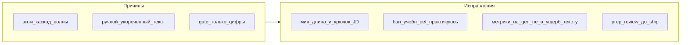

# План: качество писем после волны 20.07 (fix)

**Статус:** L0 внедрён в код (20.07) · партнёр попросил также переписать сегодняшние 5 писем на hh  
**Дата:** 20.07.2026  
**Связано:** [`HUNT-APPLY-AUTOMATION-PLAN.md`](HUNT-APPLY-AUTOMATION-PLAN.md) · [`ROLE-LADDER-M0-MATRIX.md`](ROLE-LADDER-M0-MATRIX.md) · разбор ME по раунду 1–2

---

## Сводка

Сегодня **5 ok** откликов на hh; gate `assessLetterQuality` пропускал все (есть цифры). Для HR/банка письма **раунда 2 и частично раунда 1** выглядели слабее эталона (МАГНИТ).

**L0 в коде:** `lib/letter-mid-quality.mjs` (junior / Привет брендам / DB-first) · mid-floor ≥320 в `assessLetterQualityForBatch` · фикс `pet-проект` в sanitize.  
**Сегодняшние 5:** approvedText обновлены в очереди → deliver/repair на hh (где чат открыт).

---

## Разбор всех откликов сегодня

| Время | Компания | Len | Gate | Оценка HR | Проблемы |
|------:|----------|----:|------|-----------|----------|
| 10:35 | Каспер IDP | 386 | pass | слабо | «Привет!» · −15% · «практикуюсь» K8s |
| 10:41 | **МАГНИТ Vault** | 357 | pass | **эталон дня** | почти ок: Softline SLA + секреты под Vault |
| 10:48 | Рестрим | 245 | pass | слабо | коротко · MSSQL/реплики = L2, не DevOps |
| 11:30 | ДОМ.РФ ЕФО | 264 | pass | слабо | коротко · «в -проектах» (обрезка pet) · мало банковского/автоматизации |
| 11:33 | Сбер SberTech | 288 | pass | слабо | «учебных стендах» K8s · два «готов» · мало SberTech-крючка |

**Отказы сегодня (не наши письма раунда):** Miractal, BI.ZONE PAM — не следствие этих 5 текстов, но фон давления на «качество».

### Корневые причины

1. **Анти-каскад волны** (−15% / IT_One+СБП) решали **укорачиванием и ручной заменой**, а не полноценным regen с M0-матрицей.  
2. **`letterHasCandidateMetric`** = «есть любая цифра» → 2+ сервиса / 3+ инстанса проходят, хотя текст пустой для банка.  
3. **Нет hard-ban** на «учебн* / pet / практикуюсь / знаком на стендах» в письме middle DevOps.  
4. **Sanitize/обрезка** могла съесть «pet» → «в -проектах» (ДОМ.РФ) — баг качества.  
5. Ритуал: ship сразу после ручного патча, **без ME/глаз** на банк/Сбер.

---

## Влияние и риски

| Изменение | Влияние | Риск | Тяжесть |
|-----------|---------|------|---------|
| Мин. длина + крючок title/JD | Письма перестанут быть «телеграммой» | Часть шаблонов не пройдёт gate | Средний |
| Ban junior-stretch фраз | Честнее mid-позиция | LLM будет обходить синонимами | Низкий |
| Жёстче metric ≠ любая цифра | Меньше фейк-метрик «2+» | False fail на коротких ок письмах | Средний |
| Wave-aware gen (не ручной укор) | Разнообразие без потери текста | Сложнее regen | Средний |
| Не трогать уже sent | Честность на hh | Старые слабые письма остаются | Принято |

**Допущения и риски:**
- Предполагаем: партнёр не просит переписать уже отправленные чаты.  
- Может пойти не так: слишком жёсткий gate остановит охоту — сначала soft (warn) на 1 сессию, потом hard.  
- Запасной вариант: только чеклист prep + мин. 320 символов, без смены metric-логики.

---

## Этапы исправлений

### L0 — срочно (до следующего ship, ~1–2 ч) ✅ 20.07

| # | Что | Где | Статус |
|---|-----|-----|--------|
| L0.1 | Запрет junior-stretch (`учебн*`, `практикуюсь`, `pet`) | `letter-mid-quality` → `assessLetterQuality` | ✅ |
| L0.2 | Мин. длина ≥320 для point/batch | `assessLetterQualityForBatch` + `resolveLetterMinLength` | ✅ |
| L0.3 | Фикс `pet-проект` → не «в -проектах» | `letter-ru-sanitize` | ✅ |
| L0.4 | Бренд/банк → не «Привет!» | `detectInformalBrandGreeting` | ✅ |
| L0.5 | DB-first на DevOps title (L1.2 частично) | `detectDevopsDbFirstFraming` | ✅ |
| — | **Framing router** DevOps vs L2 tone | `letter-framing-router.mjs` | ✅ 20.07 |
| — | Сегодняшние 5 на hh | regen + `fix-hh-letters-2026-07-20.mjs` | ✅ все 5 |

### L1 — качество смысла (~0,5 дня)

| # | Что |
|---|-----|
| L1.1 | «Крючок JD»: в первых 2 предложениях маркер из title (Vault/IDP/ЕФО/SberTech/автоматизац*) или fail soft |
| L1.2 | DevOps title → бан MSSQL/реплики в **первом** абзаце (L2 framing) |
| L1.3 | Wave-aware **на gen**: если сегодня уже −15% — prompt/ensureDevopsLetterMetrics не предлагает −15%; **не** укорачивать текст вручную |
| L1.4 | Эталон-фикстура: письмо уровня МАГНИТ (Vault+SLA) в golden test |

### L2 — опционально

| # | Что |
|---|-----|
| L2.1 | ME pre-ship checklist в `hunt-day prep` (3 буллета в JSON) |
| L2.2 | Дашборд: бейдж «письмо короткое / junior-stretch» на карточке |

---

## План отката

| Слой | Откат |
|------|--------|
| L0 junior-ban | `HH_LETTER_ALLOW_JUNIOR_STRETCH=1` |
| L0 min length | prefs снизить / `HH_LETTER_MIN_CHARS=0` |
| L1 JD hook | `HH_LETTER_JD_HOOK=0` |
| L1 framing | git revert sanitize rules |
| Docs | checkout docs |

Аварийный ship: `--force` (уже есть ограничения) + осознанный `--prepare-letters` только для ids.

---

## Слой тестирования

| Уровень | Что | Артефакт |
|---------|-----|----------|
| L0 unit | junior-stretch → fail; «в -проектах» не появляется; Привет+бренд → fail/rewrite | `test:letter-*` / новый `test-letter-mid-quality.mjs` |
| L0 unit | письмо 250 симв. → point-gate block | point-apply-gate test |
| L1 | fixture МАГНИТ-like pass; Рестрим-MSSQL-first fail | golden |
| L1 | wave: второй gen без −15% если первый applied-today с −15% | letter-wave + regen dry |
| L2 live | 1 dry-run ship после фикса — по просьбе | hunt-day |
| Регресс | `test:letter-wave-fingerprint`, `test:point-apply-prepare-policy` | |

**Smoke ≠ E2E.** Уже отправленные на hh не «чинятся» тестами.

---

## Чеклист приёмки

### Агент
1. L0.1–L0.5 сделаны или отложены с причиной.  
2. Тесты L0 exit 0.  
3. Явно: live после фикса — да/нет.  
4. Откат env одной строкой.

### Партнёр (~5 мин)
1. Dry-run / образец письма банка ≥320, без «учебн*».  
2. Нет «Привет!» на бренд.  
3. Вердикт: **принято** / **только L0** / **вернуть**.

---

## Порядок

1. L0.3 + L0.1 + L0.2 + L0.4 → тесты  
2. L0.5 docs  
3. L1.1–L1.4  
4. Коммит по просьбе: `fix(letters): mid quality gate — ban junior stretch, min length, pet sanitize`  
5. Следующий ship только после L0

**Фраза агенту:**  
`Сделай L0 из docs/SESSION-2026-07-20-letter-quality-fix.md (junior-ban, min 320, pet sanitize, greeting); L1 после; коммит по просьбе; уже sent на hh не трогать.`

---

## Эталон «как надо» (ориентир — МАГНИТ)

- «Здравствуйте»  
- Крючок title (Vault / команда)  
- Одна сильная метрика (SLA Softline / объём контура), **не** −15% если уже был сегодня  
- Коммерческий контур (IT_One/Softline), без «учебных стендов»  
- 320–450 символов, одно «готов обсудить»
