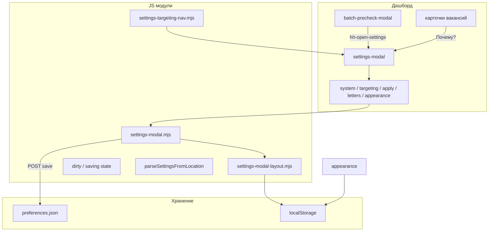

# Модалка «Настройки» дашборда

**Версия:** 4.1.0 (финализировано) · **Связано:** [COVER-LETTER-PLAN.md](COVER-LETTER-PLAN.md), [DASHBOARD.md](DASHBOARD.md), [CONFIG-GUIDE.md](CONFIG-GUIDE.md), [BATCH.md](BATCH.md)

Единый центр настроек HH Ai: пять вкладок, автосохранение, пресеты, раскладка окна, deep link и связь с precheck/батчем.

---

## Цель

Оператор за **≤30 секунд** понимает:

1. Какие отклики пойдут в «Авто» (порог, серия, лимиты).
2. Как батч обращается с письмами (подготовка, метрики, FP, обучение).
3. Как выглядит дашборд (панели, тема, карточки, размер окна настроек).

Серверные поля → `config/preferences.json`. Вид списка, масштаб, окно настроек → `localStorage`.

---

## Вкладки (кратко)

| Alt | Вкладка | Содержание |
|-----|---------|------------|
| 1 | **Система** | Профиль, готовность, Playwright, резервная копия, экспорт/импорт prefs |
| 2 | **Таргетинг** | Пресеты, «что отсекает», удалёнка, зарплата, исключения |
| 3 | **Отклики** | Порог, серия, лимиты hh, превью порога |
| 4 | **Письма** | Пресеты писем, FP, обучение, снимок hub |
| 5 | **Интерфейс** | Фильтры, панели, тема, **окно настроек** |

---

## Статус фаз

| Фаза | Содержание | Статус |
|------|------------|--------|
| **S0** | Две вкладки; автосохранение `data-pref` | [x] |
| **S1** | Три вкладки: **Отклики** / **Письма** / **Интерфейс** | [x] |
| **S2** | `settings-modal.mjs`: пресеты, сводка, warnings, hub-снимок | [x] |
| **S3** | `learningAutoApplyMinCount`; сброс раздела; Shift+⚙ | [x] |
| **S4** | Палитра «Настройки: письма»; тест вкладки `letters` | [x] |
| **S5** | Dirty-state, «Сохранить сейчас», confirm при закрытии | [x] |
| **S6** | Deep link `?settings=letters&focus=fp`; ссылки из precheck | [x] |
| **S7** | Сброс вкладки «Интерфейс» (фильтры + панели standard) | [x] |
| **S8** | Playwright E2E (`test:dashboard-settings`) | [x] |
| **S9** | Онбординг на вкладке «Письма» (dismiss в localStorage) | [x] |
| **S10** | Подсказки под полями; сброс темы/масштаба; копировать JSON писем | [x] |
| **S11** | Быстрые переходы, Alt+1…5, палитра по вкладкам | [x] |
| **S12–S15** | 5 вкладок, удалёнка, готовность системы, пресеты таргетинга | [x] |
| **S16** | «Что чаще отсекает» + `GET /api/targeting/reject-stats` | [x] |
| **S17** | Экспорт/импорт prefs (`export` / `import` API) | [x] |
| **S18** | Карточки: «Почему?» → настройки по категории reject | [x] |
| **S19** | Пресеты окна; `settings-modal-layout.mjs` | [x] |

---

## Архитектура



| Файл | Роль |
|------|------|
| `dashboard/public/settings-modal.mjs` | Вкладки, пресеты, dirty-state, URL, warnings, snapshot |
| `dashboard/public/settings-modal-layout.mjs` | Размер окна, полноэкран, пресеты раскладки |
| `dashboard/public/settings-targeting-nav.mjs` | Переход с карточки по категории reject |
| `dashboard/public/app.js` | `openDashboardSettings`, save debounce, палитра команд |
| `dashboard/public/batch-precheck-modal.mjs` | Кнопки «в настройки» |
| `lib/dashboard-preferences.mjs` | Ключи и границы чисел |

---

## Раскладка окна (S19)

| Пресет | Размер (ориентир) | Когда |
|--------|-------------------|--------|
| **Компакт** | ~448×560 | Лимиты, быстрые правки |
| **Стандарт** | CSS по умолчанию | Обычное открытие |
| **Широкое** | ~960×720 | Письма, таргетинг, инсайты |
| **Экран** | viewport | Длинные формы, конструктор панелей |

**Управление:** полоса «Окно» под быстрыми сценариями; дублирование на вкладке «Интерфейс»; угол окна — произвольный размер; **Alt+F** / двойной клик по заголовку — полноэкран; **↺** в шапке — сброс размера.

**Контекстное открытие:** быстрые сценарии и «Почему?» на карточке подбирают ширину; deep link: `?settings=targeting&settingsLayout=wide`.

**localStorage:** `hh-settings-modal-size`, `hh-settings-modal-layout-preset`, `hh-settings-modal-fullscreen`, `hh-settings-modal-open-fullscreen`.

**Полный сброс UI:** «Всё: фильтры + панели + тема» на вкладке Интерфейс → `resetSettingsModalLayout()`.

---

## Пресеты писем ↔ поведение батча

| Пресет | Precheck: автоподготовка | Пропуск без метрик | Авто-утверждение | FP guardrail |
|--------|--------------------------|--------------------|------------------|--------------|
| **Стандарт** | да (fixable) | нет | нет | при FP > 20 |
| **Строгий** | да | да | да | при FP > 15 |
| **Мягкий** | да | нет | нет | выкл (0) |
| **Вручную** | нет | нет | нет | выкл |

После смены пресета: debounce 500 ms → `POST /api/preferences/save` → инвалидация letter-stats и hub-снимка.

---

## Dirty-state (S5)

| UI | Условие |
|----|---------|
| «Есть несохранённые изменения» | `dirty`, не идёт save |
| «Сохранение…» | `saving > 0` |
| «Сохранено» | успешный save |
| Точка у заголовка (CSS) | `settings-dialog--dirty` |
| Закрытие | `tryCloseSettingsModal()` — confirm или блок при saving |

---

## Deep link

```
http://127.0.0.1:3849/?settings=letters&focus=fp
http://127.0.0.1:3849/?settings=apply&focus=limits
http://127.0.0.1:3849/?settings=targeting&settingsLayout=wide
```

| Параметр | Значения |
|----------|----------|
| `settings` / `openSettings` | `system`, `targeting`, `apply`, `letters`, `appearance`; алиасы `fp`→letters, `profile`→system |
| `focus` / `settingsFocus` | id элемента или alias (`fp`, `limits`, `insights`, …) |
| `settingsLayout` / `layout` | `compact`, `standard`, `wide`, `fullscreen` |

Алиасы: `SETTINGS_FOCUS_ALIASES` в `settings-modal.mjs`.

---

## Точки входа

| Действие | Результат |
|----------|-----------|
| «Настройки» | последняя вкладка (`sessionStorage` `hh-settings-tab`) |
| Лимиты в статусе | `apply` + лимиты, компактное окно |
| `Ctrl+K` | палитра: настройки по вкладкам, полный экран, широкое окно |
| Shift+⚙ letter-center | `letters` |
| Precheck → «Порог FP» | `letters` + focus `fp` |
| «Почему?» на карточке | `targeting` + insights, широкое окно |
| URL `?settings=…` | при старте дашборда |
| **Alt+1 … 5** | вкладки (не в поле ввода) |
| **Alt+F** | полноэкран |
| Быстро: Перед батчем / Не подходит | `letters` / `targeting`, широкое |
| Быстро: Лимиты | `apply`, компактное |

---

## E2E (S8)

`npm run test:dashboard-settings` — пресет «Строгий», save, API, deep link, Alt+1, таргетинг, пресеты окна (compact/wide), quick path «Лимиты», все 5 вкладок, Esc/backdrop, `hh-open-settings`, проверка загрузки `app.js`.

## Статика (QA, 2026-06)

| Команда | Что проверяет |
|---------|----------------|
| `npm run check:dashboard` | `node --check` на 39 модулей; незакрытый JSDoc; DOM id вкладок/полей; import `settings-modal` в `app.js` |
| `npm run quality:dashboard` | check + unit `test-dashboard-static-check` |

Контракт DOM: `SETTINGS_DOM_CONTRACT` в `lib/dashboard-static-check.mjs`. Регрессия на оборванный `/**` перед `export` — в unit-тесте.

См. [TROUBLESHOOTING.md](TROUBLESHOOTING.md) («Настройки не открываются»), [DEVELOPMENT-PLAN-2026-06.md](DEVELOPMENT-PLAN-2026-06.md).

---

## Критерии готовности (финал)

| Критерий | Проверка |
|----------|----------|
| 5 вкладок | Alt+1…5, integration |
| Dirty + save now | FP → «Сохранить сейчас» → «Сохранено» |
| Deep link tab + focus | `?settings=letters&focus=fp` |
| Deep link layout | `?settingsLayout=wide` |
| Пресеты окна | compact / wide в UI и тесте |
| Precheck → settings | precheck закрывается |
| Экспорт/импорт prefs | API + UI на вкладке Система |
| Reject → settings | «Почему?» → таргетинг |

---

## Устранение неполадок

| Симптом | Действие |
|---------|----------|
| «Сохранение недоступно» | `npm run devops:dashboard`, F5 |
| Пресет писем не подсвечивается | поля изменены вручную — норма |
| Пресет окна «сбился» | ручной ресайз → «свой» размер; ↺ или «Стандарт» |
| Снимок hub пустой | мало данных / нет `letter-metrics.jsonl` |
| Precheck не видит новый FP | дождаться «Сохранено»; перезапустить precheck |
| Закрытие не срабатывает | идёт save — «Сохранить сейчас» |

---

## Команды

```bash
npm run dashboard
# Ctrl+F5 (кэш app.js: lib/dashboard-asset-version.mjs → index.html ?v=)

npm run check:dashboard
npm run quality:dashboard
npm run test:dashboard-settings
npm run test:dashboard
npm run quality:check
```

---

## Roadmap (после финала)

| ID | Задача | Статус |
|----|--------|--------|
| Q9 | Вкладка «Письма», пресеты | [x] |
| Q10 | Dirty-state + deep link + precheck | [x] |
| R4.6 | Модалка 5 вкладок | [x] |
| R4.7 | E2E настроек (S8 + layout) | [x] |
| — | Индикатор dirty на всех вкладках | [x] |
| — | Единый `modal-layout.mjs` для воронки / журнала | backlog |

---

## Чеклист оператора перед батчем

1. `npm run quality:check` (перед релизом/крупными изменениями).
2. **Настройки** → быстро **«Перед батчем»** (или Письма → пресет **Стандарт** / **Строгий**).
3. Дождаться **Сохранено** (или «Сохранить сейчас»).
4. Запуск серии → precheck → при FP guardrail — правила или порог FP.
5. После батча — hub / `data/letter-quality-report.json`.
