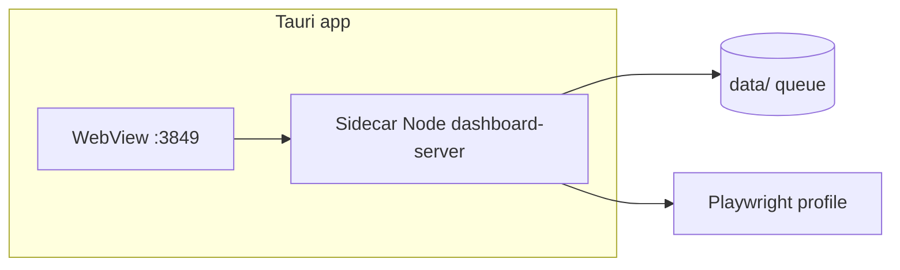

# План HH Ai Desktop (Tauri 3.0)

**Статус:** alpha scaffold · **Версия:** 3.0.0-alpha.0

Цель: приложение «как программа» без терминала для ежедневной работы с очередью откликов.

---

## Фазы

| Фаза | Содержание | Статус |
|------|------------|--------|
| **0** | Scaffold `desktop/hh-ai-desktop`, `npm run desktop:launcher` | [x] |
| **1** | WebView → `http://127.0.0.1:3849`, проверка «дашборд не запущен» | [x] |
| **2** | Sidecar: встроенный spawn `dashboard-server.mjs` при старте app | [x] |
| **3** | Кнопка «Установить Chromium» → `npx playwright install chromium` | [x] |
| **4** | Installer `.msi` / `.exe` в CI, автообновление (optional) | [ ] |

---

## Архитектура (целевая)

Сейчас (фаза 3): экран подготовки с кнопкой «Установить Chromium» (`scripts/desktop-chromium.mjs`); sidecar дашборда — фаза 2. Сборка installer — фаза 4.

---

## Команды

| Команда | Назначение |
|---------|------------|
| `npm run desktop:check` | Rust / scaffold / dashboard-server |
| `npm run desktop:launcher` | Interim: PowerShell старт дашборда + браузер |
| `npm run desktop:smoke` | Sidecar + chromium check без Tauri |
| `npm run desktop:install-chromium` | Playwright Chromium из терминала |
| `cd desktop/hh-ai-desktop && npm run tauri:dev` | Tauri dev (нужен Rust) |
| `cd desktop/hh-ai-desktop && npm run tauri:build` | Сборка installer |

---

## Ограничения

- Сессия hh.ru остаётся в `data/session/` — не выносим на сервер (SECURITY.md).
- Playwright/Chromium — отдельная установка; bundled Chromium в installer — фаза 3+.
- Harvest/batch в desktop = те же скрипты, без обхода rate-limit.

---

## Связь с roadmap

- R6.1 Tauri-оболочка → этот документ
- R6.2 Встроенный Chromium → фаза 3
- Portable zip (2.2.0) остаётся для пользователей без Rust
