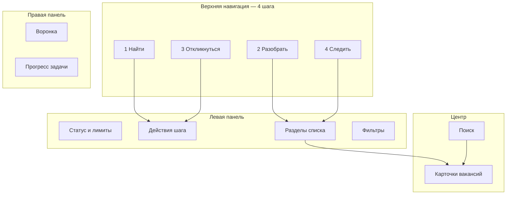

# UI/UX Redesign v4 — HH Ai Dashboard

**Статус:** завершён (фазы 1–4 + QA) · **Версия интерфейса:** 4.0  
**Цель:** сделать дашборд понятным человеку без технического бэкграунда, сохранив весь функционал для продвинутых пользователей.

---

## 1. Диагностика (текущие проблемы)

| Проблема | Пример | Влияние |
|----------|--------|---------|
| Жаргон | batch, harvest, Probe, L2/L3, Prune | Непонятно новичку |
| Дублирование | Меню + сайдбар + toolbar + palette | Неясно, куда нажать |
| CRM-перегруз | 3 колонки, 11 блоков сайдбара | Когнитивная нагрузка |
| Сжатые подписи | «Без анк.», «Ручн.», «<порог» | Нужно угадывать |
| Expert/simple | Скрывает кнопки, но не упрощает язык | Ложное ощущение простоты |
| Монолит app.js | ~5200 строк | Сложно развивать UI |

---

## 2. Принципы v4

1. **Путь пользователя, не функции** — 4 шага: Найти → Разобрать → Откликнуться → Следить.
2. **Русский plain language** — без англ. терминов в видимых подписях.
3. **Progressive disclosure** — простой режим по умолчанию; сервис и тонкие настройки — по запросу.
4. **Один главный CTA на экране** — остальное вторично или в «Ещё».
5. **Сохранение ID и API** — рефакторинг визуала без поломки Playwright-тестов и app.js.

---

## 3. Информационная архитектура



### Шаг «Найти»
- Действие: «Запустить поиск», период (1–30 дней).
- Результат: новые вакансии в «Очередь».

### Шаг «Разобрать»
- Вкладки: Очередь, Без анкет, Анкета, Скрытые, Отложенные.
- Фильтры: рекомендуемые / ниже порога / все; проверка / подходят / отклонённые.
- Карточка: решение, письмо, анкета.

### Шаг «Откликнуться»
- Авто-отклики (≥ порога), ручные (< порога) — expert.
- Журнал и пауза/стоп.

### Шаг «Следить»
- Вкладка «Отклики», утренний цикл, воронка, чаты.

---

## 4. Визуальный язык v4

| Токен | Значение |
|-------|----------|
| `--v4-accent` | #3b82f6 — основной акцент |
| `--v4-surface` | #111114 — фон приложения |
| `--v4-panel` | #1a1a1f — панели |
| `--v4-elevated` | #222228 — карточки блоков |
| `--v4-radius-lg` | 12px — секции сайдбара |
| `--v4-step-active` | подсветка текущего шага workflow |

- Шрифт: system-ui stack (без изменений).
- Кнопки: min-height 36px, primary — заливка, secondary — outline.
- Сайдбар: секции как «карточки» с заголовком и отступом.
- Вкладки разделов: перенос строк, полные слова, счётчики.

---

## 5. Фазы реализации

### Фаза 1 — Foundation
- [x] План `docs/UI-REDESIGN-v4.md`
- [x] `dashboard-v4.css` + токены
- [x] Workflow nav в header (`ui-workflow.mjs`)
- [x] COPY v4 в `dashboard-ux.mjs`
- [x] Русские подписи в `index.html`
- [x] Класс `workspace-shell--v4` на `#app-shell`
- [x] Smoke: `test-dashboard-ui`, `verify:local`

### Фаза 2 — Карточки и модалки
- [x] Footer карточки: группы «Отклик» / «Письмо» / «Ещё» (`details`)
- [x] Настройки: 2 вкладки («Отклики и лимиты», «Список и вид»)
- [x] Онбординг-wizard: 4 шага, прогресс, кнопки действий
- [x] Модалка настроек: plain language, expert-пути в `ui-expert-only`

### Фаза 3 — Конструктор панелей
- [x] Drag-and-drop порядок блоков (`ui-sidebar-builder.mjs`)
- [x] Пресеты Минимум / Стандарт / Всё с порядком и видимостью
- [x] Конструктор доступен в простом режиме
- [x] Автоопределение активного пресета / «Своя конфигурация`

### Фаза 4 — Мобильная адаптация
- [x] Collapse docks → bottom sheet на ≤1024px
- [x] Touch targets 44px
- [x] Нижняя панель: Меню · Список · Сводка · Ещё

### QA
- [x] `test-dashboard-integration.mjs`
- [x] `test-dashboard-copy.mjs`
- [x] Workflow: «Найти» / «Откликнуться» не сбрасываются при клике

---

## 6. Карта терминов (старый → v4)

| Было | Стало |
|------|-------|
| batch / батч | Серия откликов |
| harvest | Поиск вакансий |
| Probe анкет | Проверить анкеты |
| Prune | Убрать откликнувшиеся |
| L2/L3 | эталон резюме |
| MD | Экспорт текста |
| PDF (кнопка) | Резюме PDF |
| Авто / <порог | Рекомендуемые / Ниже порога |
| Без анк. | Без анкет |
| Отлож. | Отложенные |
| Ручн. | Вручную |

---

## 7. Тестирование

```powershell
npm run dashboard          # Ctrl+F5
node scripts/test-dashboard-ui.mjs
node scripts/test-dashboard-integration.mjs
node scripts/test-dashboard-copy.mjs
npm run verify:local
```

Критерии приёмки фазы 1:
- Workflow nav переключает контекст без ошибок в консоли
- Все существующие ID кнопок на месте
- UI smoke зелёный
- Нет англ. жаргона в видимых подписях (simple mode)

---

## 8. Связанные документы

- [UX-FRICTION-LOG.md](UX-FRICTION-LOG.md)
- [ROADMAP.md](ROADMAP.md) — R1.6/R1.7 UX
- `dashboard/public/dashboard-ux.mjs` — единый словарь COPY
